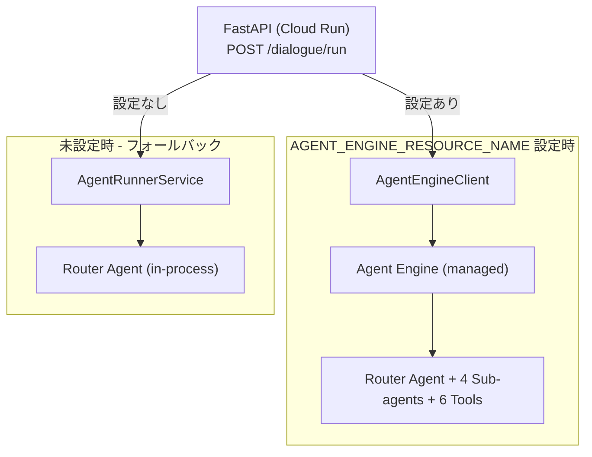

# Hobot 小学生の「考える力」を育てる宿題コーチロボット - Google AI エージェントハッカソン

## プロジェクト概要

共働き世帯68.5%が直面する「宿題バトル」問題を、AIエージェント技術で解決します。Google ADK（Agent Development Kit）とGemini Live APIを活用し、小学校低学年向けにソクラテス式対話で思考プロセスを支援する音声コーチを実装。マルチエージェント構成（算数・国語・励まし・復習の専門エージェント）、Vertex AI Memory Bankによる学習履歴活用、音声感情分析による適応的支援により、宿題時間を60分→30分に短縮。親は教育タスクから解放され、子供の成長を見守る時間に変わります。Vertex AI Agent Engineでスケーラブルにデプロイしています。

## はじめに

平日の夜7時、親子が宿題をめぐって口論しています。小学2年生が泣き、親は苛立ち、双方とも疲弊している――観察すれば、こうした光景は決して珍しくありません。

私自身、共働き世帯の2児の父として「叱ることは良くない」と分かりつつも叱ってしまう罪悪感を感じています。

毎日直面している問題をAIエージェントを使って解決できないかと考え、
宿題のコーチロボットサービスを開発しました。

## 問題の構造分析

厚生労働省の調査によれば、共働き世帯は全体の68.5%を占めています。両親が働く家庭において、平日夜の時間は極めて限られたリソースです。仮に帰宅が18時、就寝が21時とすれば、可処分時間は3時間。食事、入浴、翌日の準備を差し引けば、親子の自由な時間は実質1時間程度。

この貴重な1時間が「宿題」という避けられないタスクによって消費されます。本当の問題は、このタスクが高確率で親子間の衝突を引き起こす点にあります。

**構造的な要因:**

1. **親の教育スキル不足**: 多くの親は教育の専門家ではありません
2. **双方の疲労**: 親も子も一日の終わりで認知資源が枯渇しています
3. **時間的プレッシャー**: 「早く終わらせなければ」という焦りが冷静さを奪います

結果として、本来は親子の関係性を深める時間が、むしろ関係性を損なう時間になってしまっています。

## 技術的に可能な解決策

AIエージェントを活用することによって「親子の時間をよりよくする」というテーマに立ち向かおうと考えました。

**宿題コーチロボット**は、Google ADK（Agent Development Kit）とGemini Live APIを用いた音声エージェントシステムです。対象は小学校低学年（1〜3年生）。設計思想はシンプルで、「答えを教えない」「子供自身が思考するプロセスを支援する」という2点に集約されます。

親の役割は教師ではなく観察者になります。AIが教育的対話を担当し、親は子供が自力で解決した瞬間を共有する。役割分担として、これは合理的です。

**AIの優位性:**

- **反復耐性**: 同じ質問に対して感情的な反応を示しません
- **適応的介入**: 音声解析により子供の感情状態を推定し、支援レベルを調整します
- **段階的ヒント提供**: ソクラテス式対話により、答えではなく思考の道筋を示します
- **認知負荷の分散**: 親は教育タスクから解放され、感情的支援に専念できます

計算してみると、宿題時間が60分→30分に短縮されれば、親子は追加で30分の自由時間を得られます。重要なのは、その時間が衝突ではなく協調の上に成り立っているという点です。

## 5つの技術的チャレンジと解決策

本プロダクトはGoogle AI エージェントハッカソンへの提出作品として開発しました。開発期間約2週間で、以下の技術課題を解決しています。

### 1. LLMの幻覚問題への対処（Phase 2a）

**課題**: 計算検証をプロンプトのみで行うと、LLMの幻覚により不正確な結果になる

**解決策**: ADK Function Toolsで5つの専用ツールを実装

- `calculate_tool`: 計算検証（LLM幻覚の排除）
- `manage_hint_tool`: 3段階ヒントシステムの状態管理
- `check_curriculum_tool`: 学年別カリキュラム参照
- `record_progress_tool`: 学習プロセスのポイント付与
- `analyze_image_tool`: Gemini Visionによる宿題画像分析

### 2. 教科ごとの最適化（Phase 2b）

**課題**: 単一エージェントでは、算数と国語で異なる指導戦略を使い分けることが困難

**解決策**: マルチエージェント構成

- Router Agent（振り分け）
- Math Coach Agent（算数専門）
- Japanese Coach Agent（国語専門）
- Encouragement Agent（励まし・休憩提案）
- Review Agent（復習・振り返り）

ADK AutoFlowにより、子供の入力を分析して最適な専門エージェントに自動委譲します。

### 3. 過去の学習履歴の活用（Phase 2c）

**課題**: キーワードベースの検索では、意味的に関連する過去の学習内容を見つけられない

**解決策**: Vertex AI Memory Bank統合

- LLMが対話履歴から「事実」を自動抽出
- セマンティック検索により、過去の学習パターンを活用
- Review Agentが個別化された対話を生成

### 4. 子供の感情状態への適応（Phase 2d）

**課題**: イライラしている子供に通常のペースで進めると、学習意欲を損なう

**解決策**: 感情適応エージェント

- Router Agentが毎ターン感情状態を分析
- `update_emotion_tool`で記録（frustration, confidence, fatigue, excitement）
- 感情ベースルーティング（高frustration → 励ましエージェントに委譲）

### 5. スケーラブルなデプロイメント（Phase 3）

**課題**: Cloud Runに直接デプロイしたエージェントは、スケーリングやモニタリングの設定を自前で管理する必要がある

**解決策**: Vertex AI Agent Engine デプロイ

- マネージドなエージェント実行環境
- セッションファクトリパターンで段階的移行をサポート
- TerraformによるIaC管理

## 技術スタック

**フロントエンド:**

- Next.js 16 (App Router) + Bun + Biome + Jotai + Vitest

**バックエンド:**

- FastAPI + Google ADK + Gemini Live API + uv + Ruff + pytest

**インフラストラクチャ:**

- Google Cloud Run + Terraform + Vertex AI Agent Engine

**AI/ML:**

- Gemini Live API（リアルタイム音声対話）
- Vertex AI Memory Bank（セマンティック記憶）
- Gemini Vision（画像認識）

## 実装規模

- **開発期間**: 2026年1月31日 〜 2月15日（約2週間）
- **総テスト数**: 1,169テスト
  - Backend: 548テスト（カバレッジ90%）
  - Frontend: 621テスト（56テストファイル）
  - E2E: 9テストファイル
- **開発手法**: フルスタックTDD（Red-Green-Refactor）
- **インフラ**: Terraform as Code

## 今後の展望

1. **音声ストリーミングのAgent Engine移行**: レイテンシ削減で対話の自然性向上
2. **保護者向けダッシュボード**: BigQueryによる学習パターン分析と可視化
3. **ゲーミフィケーション**: 行動経済学的なナッジで継続率向上
4. **A/Bテスト環境**: プロンプト・ヒント戦略の定量的最適化
5. **カスタム音声感情認識モデル**: Vertex AI AutoMLで児童向けモデル構築
6. **3Dモデルを使った可愛い・かっこいいキャラクター表現**: 子供が見ていて楽しい、愛着が持てるキャラクターはBlenderでモデリング・Three.jsなどのライブラリでサービスに導入

## まとめ

**宿題コーチロボット**は、共働き世帯における時間効率の最適化を目的としたAIエージェントシステムです。

**技術的実装:**

- ✅ ADK Function Tools（LLM幻覚の排除）
- ✅ マルチエージェント構成（教科別最適化）
- ✅ Vertex AI Memory Bank（個別化）
- ✅ 感情適応エージェント（音声解析ベース）
- ✅ Agent Engineデプロイ（スケーラブル）
- ✅ フルスタックTDD（1,169テスト、カバレッジ90%）

**実用的な価値:**

- 宿題時間を60分→30分に短縮し、親子の可処分時間を増やします
- 親は教育タスクから解放され、感情的支援に専念できます
- ソクラテス式対話により、子供の思考プロセスを育成します
- 衝突の頻度を減少させ、協調的な時間配分を可能にします

---

親子関係という複雑なシステムに介入する以上、慎重な設計とデータによる検証が必要です。今後もユーザーフィードバックを収集し、定量的に改善を続けていきます。

本プロダクトは、AIエージェント技術の実用的な応用例の一つに過ぎず、
改善点は数多くあることは自覚しています。
今後も「親子の時間をより良くする」ためにAIを活用していく取り組みを続けていきます。

---

**リポジトリ**: https://github.com/arakitakashi/homework-coach-robo

**技術スタック詳細**:

- Frontend: Next.js 16 + Bun + Biome + Vitest + Jotai
- Backend: FastAPI + Google ADK + Gemini Live API + uv + Ruff
- Infrastructure: Google Cloud Run + Terraform + Vertex AI Agent Engine
