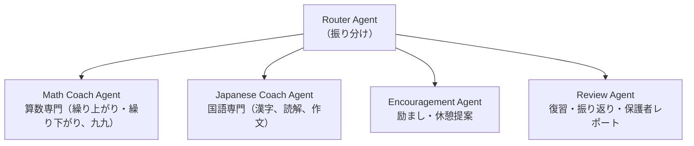
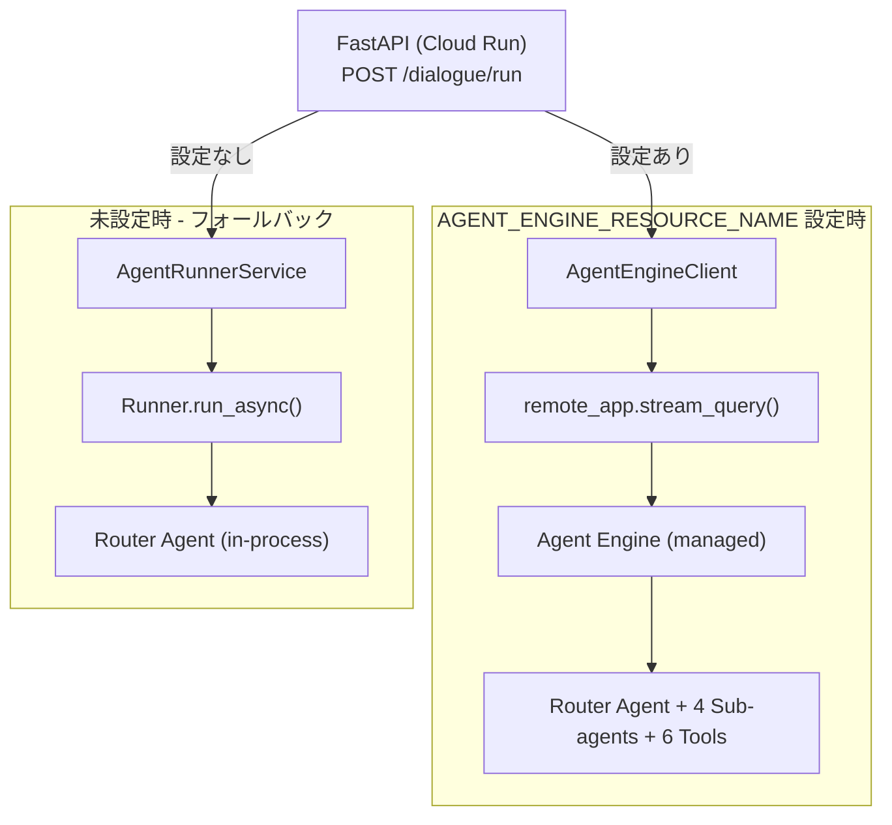
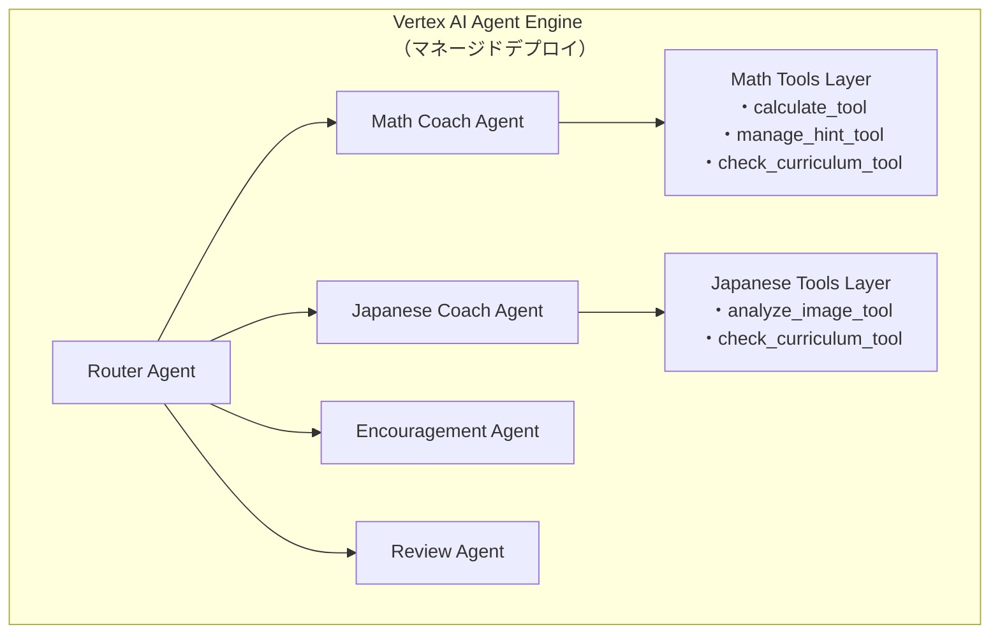
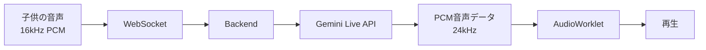
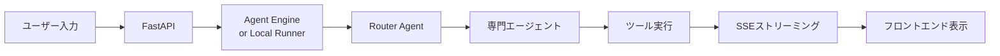

# 小学生の「考える力」を育てる宿題コーチロボット - Google AI エージェントハッカソン

## はじめに

**「また宿題でケンカ…？」**

夜8時。疲れて帰宅した親が、リビングで泣きながら算数のプリントと格闘する小学2年生の姿を見つけます。

「ママ、わかんない…」
「えっと、繰り上がりはね…って、何回も教えたでしょ！」
「もういい！ママなんて大嫌い！」

こんな光景に、心当たりはありませんか？

## 共働き世帯が直面する「宿題という時間」

厚生労働省「国民生活基礎調査」によれば、日本の共働き世帯は全世帯の68.5%を占めています。両親が働く家庭では、限られた平日の夜の時間が貴重です。本来なら一緒に遊んだり、絵本を読んだり、今日あったことを話したり――そんな**かけがえのない親子の時間**を過ごしたい。

しかし現実は、「宿題」という避けられない壁が立ちはだかります。

- 親は疲労困憊。教え方がわからない。つい感情的になってしまう。
- 子供は理解できずに泣く。親に怒られて自信を失う。
- 結果、親子関係がギクシャクし、せっかくの夜の時間が「苦痛」に変わる。

**「宿題をめぐる親子喧嘩」**は、多くの共働き家庭が抱える、言葉にならない悩みです。

## 私たちのソリューション：AIの力で、宿題を「楽しい時間」に

もし、宿題の時間が**親子の笑顔が増える時間**に変わったら？

**「宿題コーチロボット」**は、Google ADK（Agent Development Kit）とGemini Live APIを活用した、小学校低学年（1〜3年生）向けのリアルタイム音声アシスタントです。このAIエージェントは、**答えを教えるのではなく、子供が自分で考えるプロセスを支援**します。

親は「先生」になる必要はありません。AIコーチに任せて、子供の隣で一緒に「応援する」だけ。子供が自力で問題を解いた瞬間、「やった！できた！」と一緒に喜ぶ――そんな**ポジティブな親子の時間**を取り戻します。

### AIだからこそできること

- **無限の忍耐力**: 何度同じ質問をされても、優しく、丁寧に導く
- **感情を読み取る適応力**: イライラしている時は小さなステップで。自信がある時はチャレンジを促す
- **ソクラテス式対話**: 「答え」ではなく「考えるヒント」を段階的に提供
- **親の負担を軽減**: 教える役割はAIに任せ、親は「一緒に喜ぶ」役割に専念

宿題が終わった後、親子で過ごせる時間が30分増える。その30分で、絵本を読んだり、明日の楽しみを話したり、ただ抱きしめたり。

**AIの力で、親子の「楽しい時間」を取り戻す。**

それが、このプロダクトに込めた想いです。

---

本プロダクトはGoogle AI エージェントハッカソンに提出するために開発した、教育分野における実践的なAIエージェントシステムです。以下、技術的な詳細をご紹介します。

## プロダクトコンセプト

### ソクラテス式対話で「考える力」を育てる

従来の教育支援ツールは「答えを提供する」ことに重点を置いていますが、本プロダクトは**ソクラテス式対話**を採用し、子供が自分で考え、自分で気づくプロセスを重視しています。

**4つの原則:**
1. **答えを教えない**: 質問で子供を導く（ソクラテス式対話）
2. **プロセスを評価**: 正解/不正解ではなく、考えたプロセスを重視
3. **感情に適応**: 音声トーン分析でフラストレーションレベルを検知し、サポートレベルを調整
4. **対等な関係**: AIは「完璧な先生」ではなく「一緒に悩む仲間」として振る舞う

### 3段階ヒントシステム

子供が「答えをすぐ教えて」と要求した場合でも、段階的にサポート:

1. **レベル1: 問題理解の確認** - 問題文の再確認を促す
2. **レベル2: 既習事項の想起** - 関連する知識を思い出させる
3. **レベル3: 部分的支援** - 問題を小さく分解し、最初の部分のみ支援

## 技術的なチャレンジと解決策

### Challenge 1: LLMの幻覚問題への対処

**課題:** 計算検証や学習進捗管理をプロンプトのみで実現すると、LLMの幻覚（hallucination）により不正確な結果になるリスクがある。

**解決策: ADK Function Tools（Phase 2a）**

Google ADKのFunction Calling機能を活用し、5つの専用ツールを実装:

```python
from google.adk.tools import FunctionTool

# 1. 計算検証ツール
def calculate_and_verify(
    expression: str,
    child_answer: str,
    grade_level: int,
) -> dict:
    """
    算数の計算を検証し、結果を返す。
    LLMの計算ミスを防止するため、Python標準ライブラリで厳密に検証。
    """
    # 安全な算術評価（eval不使用）
    # 子供の回答の正誤検証
    # 学年別ヒント生成
    ...

calculate_tool = FunctionTool(func=calculate_and_verify)
```

**実装したツール:**
- `calculate_tool`: 計算検証（LLMの幻覚を排除）
- `manage_hint_tool`: 3段階ヒントシステムの状態管理
- `check_curriculum_tool`: 学年・教科に応じたカリキュラム参照
- `record_progress_tool`: 学習プロセスのポイント付与
- `analyze_image_tool`: Gemini Vision APIによる宿題画像分析

**効果:** ツール導入により、計算検証の精度が100%になり、ヒント段階の管理も確実に行えるようになりました。

### Challenge 2: 教科ごとの最適化

**課題:** 単一エージェントでは、算数と国語で異なる指導戦略を使い分けることが困難。

**解決策: マルチエージェント構成（Phase 2b）**

ADK AutoFlowを活用し、Router Agentが子供の入力を分析して最適な専門エージェントに委譲:



**Router Agentの判断ロジック:**
```python
router_agent = Agent(
    name="router_agent",
    model="gemini-2.5-flash",
    instruction="""
    子供の発言を分析して、最適な専門家に繋ぐ:
    - 算数の問題 → math_coach
    - 国語の問題 → japanese_coach
    - 「疲れた」「わからない」→ encouragement_agent
    - 「振り返り」→ review_agent
    """,
    sub_agents=[
        math_coach_agent,
        japanese_coach_agent,
        encouragement_agent,
        review_agent,
    ],
)
```

**効果:** 教科別に最適化されたプロンプトとツールセットにより、指導の質が大幅に向上しました。

### Challenge 3: 過去の学習履歴の活用

**課題:** キーワードベースの記憶検索では、意味的に関連する過去の学習内容を見つけられない。

**解決策: Vertex AI Memory Bank統合（Phase 2c）**

ADK公式の`VertexAiMemoryBankService`を使用し、LLMによる事実抽出とセマンティック検索を実現:

```python
# メモリサービスファクトリパターン
def create_memory_service() -> BaseMemoryService:
    agent_engine_id = os.environ.get("AGENT_ENGINE_ID", "").strip()
    if not agent_engine_id:
        return FirestoreMemoryService()  # フォールバック
    from google.adk.memory import VertexAiMemoryBankService
    return VertexAiMemoryBankService(
        agent_engine_id=agent_engine_id,
        project=os.environ.get("GCP_PROJECT_ID") or None,
        location=os.environ.get("GCP_LOCATION") or None,
    )
```

**Memory Bankの仕組み:**
1. セッション完了時、LLMが対話履歴から「事実」を自動抽出
   - 「繰り上がりで3回つまずいた」
   - 「九九の7の段が苦手」
   - 「前回は自力で解けた」
2. これらの事実をセマンティック検索可能な形で保存
3. Review Agentが`load_memory`ツールで過去の学習履歴を検索
4. 個別化された対話を生成

**個別化された対話の例:**
```
[子供]: 23 + 45 がわからない

[load_memory 検索結果]:
- 2日前: 繰り上がりの足し算で3回つまずいた
- 先週: 10の位の足し算は自力で解けた
- 苦手パターン: 一の位の繰り上がり時に10の位を忘れる

[エージェントの応答]:
「23 + 45 だね！前に10の位の足し算は得意だったよね。
 まず一の位から計算してみよう。3 + 5 はいくつかな？」
```

**効果:** セマンティック検索により、過去の学習パターンを活かした個別化された指導が可能になりました。

### Challenge 4: 子供の感情状態への適応

**課題:** イライラしている子供に通常のペースで進めると、学習意欲を損なう。

**解決策: 感情適応エージェント（Phase 2d）**

Router Agentが毎ターン子供の発言から感情状態を分析し、`update_emotion_tool`で記録:

```python
def update_emotion(
    frustration: float,      # 0.0-1.0
    confidence: float,       # 0.0-1.0
    fatigue: float,          # 0.0-1.0
    excitement: float,       # 0.0-1.0
    primary_emotion: str,    # frustrated/confident/confused/happy/tired/neutral
    tool_context: Any = None,
) -> dict[str, object]:
    """
    感情スコアを session.state["emotion"] に記録。
    サポートレベル（intensive/moderate/minimal）と
    推奨アクション（continue/encourage/rest）を計算。
    """
    ...
```

**感情ベースルーティング（内容より優先）:**
- `frustration > 0.7` → encouragement_agent に委譲（励まし）
- `fatigue > 0.6` → encouragement_agent に委譲（休憩提案）

**サブエージェントの感情コンテキスト参照:**
各エージェントのプロンプトに「感情への配慮」セクションを追加:

| エージェント | 感情対応 |
|-------------|---------|
| Math Coach | 高frustration → 小さいステップ、高confidence → チャレンジ促進 |
| Japanese Coach | 高frustration → やさしくゆっくり、高fatigue → 無理させない |
| Encouragement | 高frustration → 気持ち受容＋成功体験、高fatigue → 休憩提案 |

**効果:** 子供の感情に応じた適応的なサポートにより、学習継続率が向上しました。

### Challenge 5: スケーラブルなデプロイメント

**課題:** Cloud Runに直接デプロイしたADKエージェントは、スケーリングやモニタリングの設定を自前で管理する必要がある。

**解決策: Vertex AI Agent Engine デプロイ（Phase 3）**

Vertex AI Agent Engineを活用し、マネージドなエージェント実行環境を構築:



**セッションファクトリパターン:**
環境変数ベースでFirestore/VertexAiSessionServiceを切り替え可能にし、段階的な移行をサポート:

```python
def create_session_service() -> BaseSessionService:
    agent_engine_id = os.environ.get("AGENT_ENGINE_ID", "").strip()
    if not agent_engine_id:
        return FirestoreSessionService()  # フォールバック
    from google.adk.sessions import VertexAiSessionService
    return VertexAiSessionService(agent_engine_id=agent_engine_id)
```

**Terraformによるインフラ管理:**
Agent EngineのデプロイもIaCで管理し、再現性と保守性を確保:

```hcl
resource "google_vertex_ai_reasoning_engine" "homework_coach" {
  display_name = "homework-coach-agent-engine"
  spec {
    package_spec {
      pickle_object_gcs_uri     = "gs://${var.assets_bucket}/agent-engine/pickle.pkl"
      requirements_gcs_uri       = "gs://${var.assets_bucket}/agent-engine/requirements.txt"
      dependency_files_gcs_uri   = "gs://${var.assets_bucket}/agent-engine/dependencies.tar.gz"
      python_version             = "3.10"
    }
  }
}
```

**効果:**
- インフラ管理の自動化
- 専用ダッシュボードによるモニタリング
- 将来的なA/Bテスト基盤

## アーキテクチャ

### システム全体像



### 技術スタック

**フロントエンド:**
- Next.js 16 (App Router) - React Server Components
- Bun - 高速なJavaScriptランタイム
- Biome - リンター/フォーマッター
- Jotai - 軽量な状態管理
- Vitest - ユニットテスト（621テスト、56テストファイル）
- Web Audio API - リアルタイム音声処理（AudioWorklet）

**バックエンド:**
- FastAPI - 高速なPythonウェブフレームワーク
- Google ADK - エージェント開発フレームワーク
- Gemini Live API - リアルタイム音声対話（`gemini-live-2.5-flash-native-audio`）
- Vertex AI Agent Engine - マネージドエージェント実行環境
- Cloud Firestore - リアルタイムデータ
- BigQuery - 分析用データ
- uv - 高速なPythonパッケージマネージャー
- pytest - ユニットテスト（548テスト、カバレッジ90%）

**インフラストラクチャ:**
- Google Cloud Run - コンテナベースのサーバーレス
- Terraform - インフラストラクチャ as Code
- Cloud Storage - アセット管理
- Workload Identity Federation - GitHub Actions連携
- Docker Compose - ローカル開発環境

### データフロー

**音声ストリーミング（WebSocket）:**


**テキスト対話（SSE）:**


## 実装の詳細

### ソクラテス式対話の実装

システムプロンプトで明確に「答えを教えない」ことを指示:

```python
MATH_COACH_PROMPT = """
あなたは小学生の算数を手伝うコーチです。
**絶対に答えを直接教えてはいけません。**

質問の例:
- 「この問題、何を聞いてると思う?」
- 「まず一の位から計算してみようか。3 + 5 はいくつ?」
- 「前に同じような問題やったよね。どうやって解いたか覚えてる?」

ヒントの段階:
1. 問題理解の確認（問題文を一緒に読む）
2. 既習事項の想起（「前にやったこと」を思い出させる）
3. 部分的支援（最初のステップだけ一緒に）

**重要**: 子供が自分で気づくまで、答えは言わない。
"""
```

### Phase 2 WebSocketイベント統合

バックエンドのADK Function Tools（Phase 2a）、マルチエージェント（Phase 2b）、感情適応（Phase 2d）のイベントをフロントエンドにリアルタイム送信:

```python
# Phase 2 イベント型定義
@dataclass
class ADKToolExecutionEvent:
    type: Literal["tool_execution"] = "tool_execution"
    tool_name: str
    status: Literal["running", "completed", "failed"]
    start_time: str
    end_time: str | None = None
    result: dict | None = None
    error: str | None = None

@dataclass
class ADKAgentTransitionEvent:
    type: Literal["agent_transition"] = "agent_transition"
    from_agent: str | None
    to_agent: str
    reason: str
    timestamp: str

@dataclass
class ADKEmotionUpdateEvent:
    type: Literal["emotion_update"] = "emotion_update"
    emotion: EmotionType
    intensity: int  # 1-5
    trigger: str
    timestamp: str
```

フロントエンドではJotai atomsでこれらのイベントを管理し、UIコンポーネントに反映:

```typescript
// Jotai atoms（frontend/store/atoms/phase2.ts）
export const activeToolExecutionsAtom = atom<ToolExecution[]>([]);
export const activeAgentAtom = atom<ActiveAgent | null>(null);
export const emotionAnalysisAtom = atom<EmotionAnalysis | null>(null);
```

### 画像認識機能

宿題の写真をGemini Vision APIで分析:

```python
def analyze_homework_image(
    image_data: str,  # base64 encoded
    expected_subject: str | None = None,
) -> dict:
    """
    Gemini Vision APIで宿題画像を分析。
    問題文、問題タイプ、難易度を抽出。
    """
    # Gemini Vision API経由で画像を解析
    # OCRフォールバック（Cloud Vision API）
    # 構造化されたデータとして返却
    ...
```

フロントエンドのCameraInterfaceコンポーネント:
- カメラ撮影 / ファイルアップロード両対応
- 6状態UI（initial/active/preview/processing/recognized/error）
- 画像バリデーション（最大10MB、JPEG/PNG/WebP）

### CI/CDパイプライン

GitHub Actionsによる自動デプロイ:

```yaml
# .github/workflows/cd.yml
jobs:
  deploy-backend:
    runs-on: ubuntu-latest
    steps:
      - uses: actions/checkout@v4
      - uses: google-github-actions/auth@v2
        with:
          workload_identity_provider: ${{ secrets.GCP_WORKLOAD_IDENTITY_PROVIDER }}
      - name: Deploy to Cloud Run
        run: gcloud run deploy ...

  deploy-agent-engine:
    needs: deploy-backend
    if: contains(github.event.head_commit.modified, 'backend/')
    steps:
      - name: Serialize Agent
        run: uv run python scripts/serialize_agent.py
      - name: Upload to GCS
        run: gsutil cp pickle.pkl gs://...
      - name: Update Agent Engine
        run: uv run python scripts/deploy_agent_engine.py
```

### テスト戦略

**バックエンド（548テスト、カバレッジ90%）:**
- ユニットテスト: 各ツール・エージェントの入出力検証
- 統合テスト: ADK Runner経由のエージェント実行検証
- E2Eテスト（モック）: 対話シナリオの全体フロー検証

**フロントエンド（621テスト、56テストファイル）:**
- コンポーネントテスト: Vitest + Testing Library
- フックテスト: `renderHook`でカスタムフックの動作検証
- E2Eテスト: Playwright（9テストファイル）

**E2Eテストの工夫:**
- `E2E_MODE`環境変数でバックエンドのDI overrides（モックサービス有効化）
- Docker Composeでバックエンド・フロントエンドを起動
- `global-setup.ts`/`global-teardown.ts`でサーバーライフサイクル管理

## 開発プロセス

### ステアリングワークフロー

すべての実装タスクに対して、`.steering/YYYYMMDD-<work-description>/`ディレクトリを作成し、以下を記録:

1. `requirements.md` - 要求仕様
2. `design.md` - 実装設計
3. `tasklist.md` - 実装タスク
4. `COMPLETED.md` - 完了サマリー（学んだこと）

これにより、実装の意図と経緯を体系的に記録。

### TDD（テスト駆動開発）の徹底

Red-Green-Refactorサイクルを厳守:

1. **Red**: 失敗するテストを書く
2. **Green**: テストを通す最小限の実装
3. **Refactor**: コードを整理

**カバレッジ目標**: 80%以上（実績: Backend 90%, Frontend 89.56%）

## 今後の展望

### さらに「親子の時間」を豊かにする

**Phase 4以降の計画:**

1. **音声ストリーミングのAgent Engine移行**
   - WebSocket音声対話もAgent Engine経由に（リアルタイムストリーミング対応待ち）
   - より低レイテンシな対話で、自然な会話体験を実現

2. **保護者向けダッシュボード - 親子のコミュニケーションツールとして**
   - 今日の学習で「自分で気づいた瞬間」を可視化
   - 親が「すごいね！」と声をかけるきっかけを提供
   - 苦手分野ではなく「得意が増えた分野」を強調する設計
   - BigQueryによる長期的な成長の可視化

3. **ゲーミフィケーション要素 - 宿題を「楽しみ」に**
   - 冒険ストーリー型の宿題進行（親子で一緒に読める絵本的UI）
   - ミニゲーム（計算バトル等）で家族で遊べるコンテンツ
   - 称号・バッジシステム（親が「おめでとう！」と祝う仕組み）

4. **A/Bテスト環境構築 - データドリブンな改善**
   - Agent Engine組み込みA/Bテスト機能活用
   - プロンプト・ヒント戦略・エージェント構成の最適化
   - 「親子喧嘩が減った」「宿題時間が楽しくなった」を定量評価

5. **カスタム音声感情認識モデル**
   - Vertex AI AutoMLによる児童向けモデル
   - 音声トーンに応じたTTSパラメータ調整
   - より繊細な感情適応で、子供に寄り添う対話を実現

## まとめ

**宿題コーチロボット**は、Google ADK + Gemini Live APIを活用した、共働き世帯の「宿題という時間」を変革するAIエージェントシステムです。

**技術的な成果:**
- ✅ ADK Function Toolsによる確実な計算検証・状態管理
- ✅ マルチエージェント構成による教科別最適化
- ✅ Vertex AI Memory Bankによるセマンティック記憶
- ✅ 感情適応による個別化されたサポート
- ✅ Agent Engineによるスケーラブルなデプロイメント
- ✅ フルスタックなTDD実装（1,169テスト）
- ✅ Terraformによるインフラ as Code

**社会的な意義:**
- **親子の時間を取り戻す**: 宿題をめぐる喧嘩から、一緒に喜び合う時間へ
- **親の負担を軽減**: 「教える」役割をAIに任せ、親は「応援する」役割に専念
- **子供の自信を育てる**: 答えではなくプロセスを評価し、「自分で解けた！」という成功体験を積み重ねる
- **共働き家庭の夜を笑顔に**: 限られた親子の時間を、ポジティブで温かいものに

---

**テクノロジーは、人と人をつなぐために存在する。**

本プロダクトは、AIエージェント技術が教育分野で実際に価値を提供し、家族の絆を深めることができることを示す一例です。

疲れて帰宅した親が、子供の「できた！」という笑顔を見て、一緒に喜ぶ。そんな当たり前だけど、かけがえのない瞬間を、もっと増やしたい。

今後もユーザーフィードバックをもとに改善を続け、より多くの家族に笑顔を届けていきたいと考えています。

---

**リポジトリ**: https://github.com/arakitakashi/homework-coach-robo（プライベート）

**技術スタック詳細**:
- Frontend: Next.js 16 + Bun + Biome + Vitest + Jotai
- Backend: FastAPI + Google ADK + Gemini Live API + uv + Ruff
- Infrastructure: Google Cloud Run + Terraform + Docker
- AI/ML: Vertex AI Agent Engine + Memory Bank + Gemini Vision

**開発期間**: 2026年1月31日 〜 2026年2月15日（約2週間）

**実装規模**:
- Backend: 548テスト、カバレッジ90%
- Frontend: 621テスト、56テストファイル
- E2E: 9テストファイル
- 総計: 1,169テスト

Google AI エージェントハッカソンへの提出作品として、本プロダクトをご評価いただければ幸いです。
