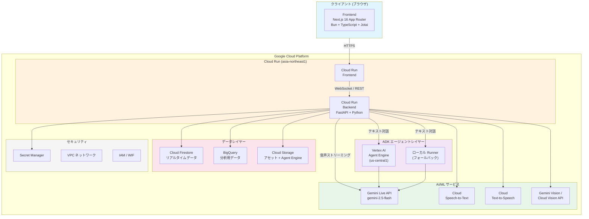
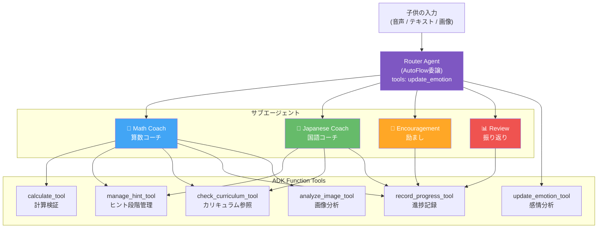
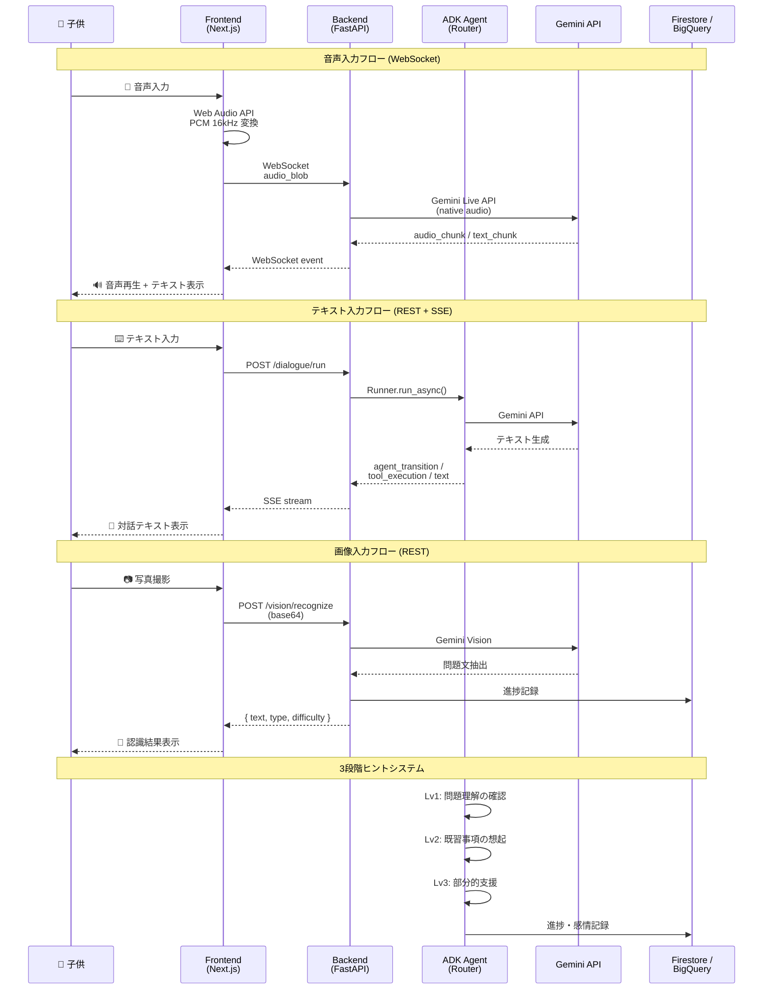
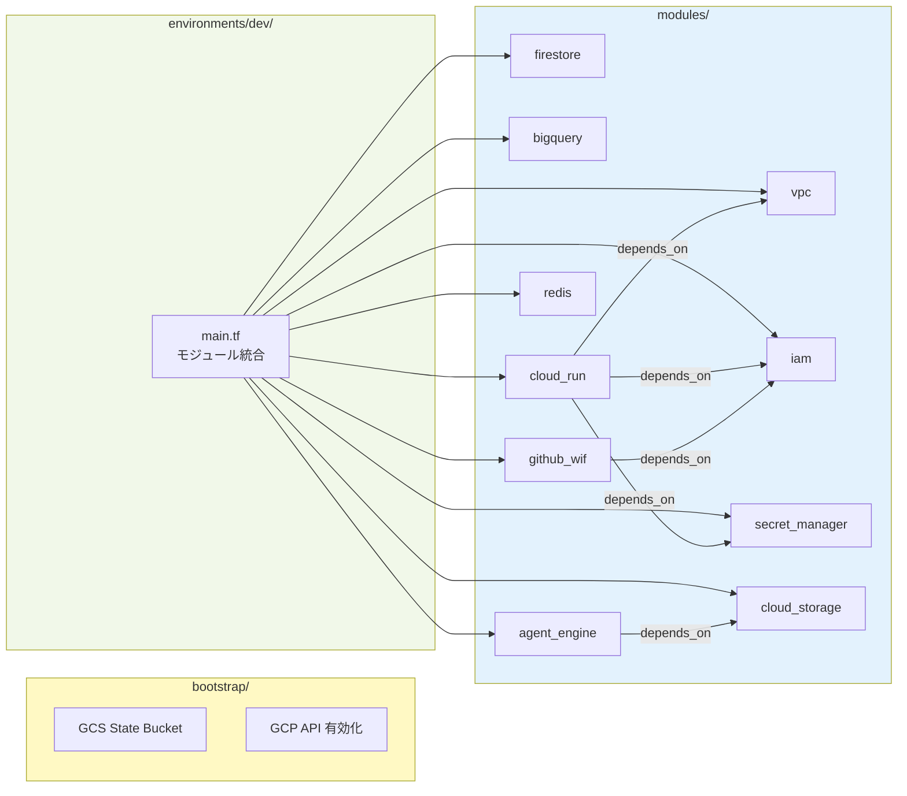
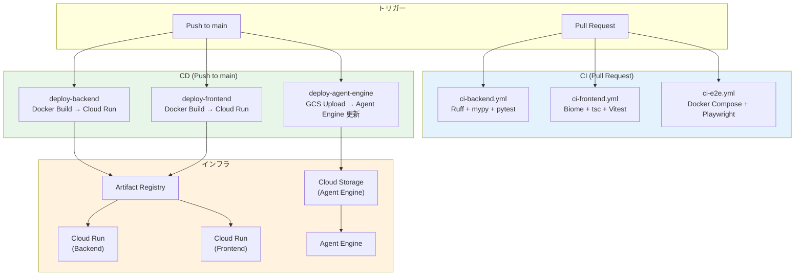
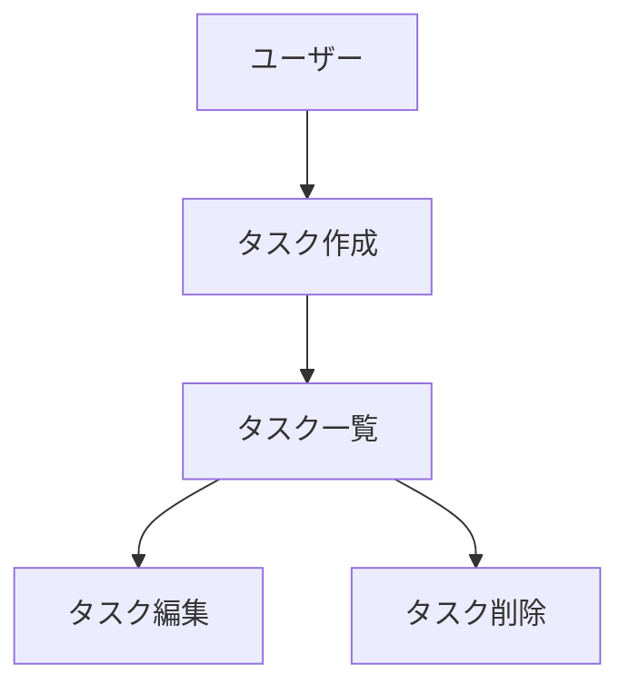

## 概要

**宿題コーチロボット (Homework Coach Robot)** は、小学校低学年（1〜3年生）向けのリアルタイム音声アシスタントです。答えをすぐに教えるのではなく、ソクラテス式対話で子供が自分で考え、自分で気づくプロセスを支援します。

開発を進めるうえで遵守すべき標準ルールを定義します。

## アーキテクチャ

### システム全体構成



### マルチエージェント構成 (ADK Phase 2)



### データフロー



### インフラストラクチャ (Terraform)



### CI/CD パイプライン



## ローカル開発環境（Docker）

Dockerを使用してローカルでアプリケーションを起動する手順です。

### 前提条件

- Docker Desktop がインストールされていること
- Google Cloud 認証が設定されていること（Gemini APIを使用する場合）

### クイックスタート

```bash
# 1. リポジトリをクローン
git clone https://github.com/arakitakashi/homework-coach-robo.git
cd homework-coach-robo

# 2. 環境変数ファイルを作成（オプション）
cp .env.example .env
# 必要に応じて .env を編集

# 3. Docker Compose で起動
docker compose up

# バックグラウンドで起動する場合
docker compose up -d
```

### アクセスURL

| サービス | URL | 説明 |
|----------|-----|------|
| Frontend | http://localhost:3000 | Next.js フロントエンド |
| Backend | http://localhost:8080 | FastAPI バックエンド |
| API Docs | http://localhost:8080/docs | Swagger UI |
| Health Check | http://localhost:8080/health | ヘルスチェック |

### よく使うコマンド

```bash
# 起動
docker compose up

# バックグラウンド起動
docker compose up -d

# 停止
docker compose down

# ログ確認
docker compose logs -f

# 特定サービスのログ
docker compose logs -f backend
docker compose logs -f frontend

# 再ビルド（依存関係変更時）
docker compose build --no-cache
docker compose up

# コンテナ内でコマンド実行
docker compose exec backend uv run pytest
docker compose exec frontend bun test
```

### 環境変数

| 変数名 | デフォルト値 | 説明 |
|--------|-------------|------|
| `GOOGLE_CLOUD_PROJECT` | `homework-coach-robo` | GCPプロジェクトID |
| `GOOGLE_CLOUD_LOCATION` | `asia-northeast1` | GCPリージョン |
| `NEXT_PUBLIC_API_URL` | `http://localhost:8080` | バックエンドAPI URL |

### Google Cloud 認証（Gemini API使用時）

対話機能を使用する場合は、Google Cloud認証が必要です。

```bash
# 1. gcloud CLI で認証
gcloud auth application-default login

# 2. 環境変数を設定
export GOOGLE_CLOUD_PROJECT=your-project-id

# 3. Docker Compose で起動（認証情報をマウント）
docker compose -f docker-compose.yml -f docker-compose.gcloud.yml up
```

### トラブルシューティング

#### ポートが使用中の場合

```bash
# 使用中のポートを確認
lsof -i :3000
lsof -i :8080

# プロセスを終了するか、docker-compose.yml でポートを変更
```

#### 依存関係のキャッシュをクリアしたい場合

```bash
# ボリュームを削除して再起動
docker compose down -v
docker compose up --build
```

### Docker を使わない開発

Dockerを使わずにローカルで開発する場合は、以下を参照してください：

- **バックエンド**: `backend/README.md`
- **フロントエンド**: `frontend/README.md`

## プロジェクト構造

本リポジトリは、小学生の宿題コーチロボ専用のリポジトリです。

### ドキュメントの分類

#### 1. 永続的ドキュメント（`docs/`）

アプリケーション全体の「**何を作るか**」「**どう作るか**」を定義する恒久的なドキュメント。
アプリケーションの基本設計や方針が変わらない限り更新されません。

- **product-requirements.md** - プロダクト要求定義書
  - プロダクトビジョンと目的
  - ターゲットユーザーと課題・ニーズ
  - 主要な機能一覧
  - 成功の定義
  - ビジネス要件
  - ユーザーストーリー
  - 受け入れ条件
  - 機能要件
  - 非機能要件

- **functional-design.md** - 機能設計書
  - 機能ごとのアーキテクチャ
  - システム構成図
  - データモデル定義（ER図含む）
  - コンポーネント設計
  - ユースケース図、画面遷移図、ワイヤフレーム
  - API設計（将来的にバックエンドと連携する場合）

- **architecture.md** - 技術仕様書
  - テクノロジースタック
  - 開発ツールと手法
  - 技術的制約と要件
  - パフォーマンス要件

- **repository-structure.md** - リポジトリ構造定義書
  - フォルダ・ファイル構成
  - ディレクトリの役割
  - ファイル配置ルール

- **development-guidelines.md** - 開発ガイドライン
  - コーディング規約
  - 命名規則
  - スタイリング規約
  - テスト規約
  - Git規約

- **glossary.md** - ユビキタス言語定義
  - ドメイン用語の定義
  - ビジネス用語の定義
  - UI/UX用語の定義
  - 英語・日本語対応表
  - コード上の命名規則

#### 2. 作業単位のドキュメント（`.steering/[YYYYMMDD]-[開発タイトル]/`）

特定の開発作業における「**今回何をするか**」を定義する一時的なステアリングファイル。
作業完了後は参照用として保持されますが、新しい作業では新しいディレクトリを作成します。

- **requirements.md** - 今回の作業の要求内容
  - 変更・追加する機能の説明
  - ユーザーストーリー
  - 受け入れ条件
  - 制約事項

- **design.md** - 変更内容の設計
  - 実装アプローチ
  - 変更するコンポーネント
  - データ構造の変更
  - 影響範囲の分析

- **tasklist.md** - タスクリスト
  - 具体的な実装タスク
  - タスクの進捗状況
  - 完了条件

### ステアリングディレクトリの命名規則

```
.steering/[YYYYMMDD]-[開発タイトル]/
```

**例：**

- `.steering/20250103-initial-implementation/`
- `.steering/20250115-add-tag-feature/`
- `.steering/20250120-fix-filter-bug/`
- `.steering/20250201-improve-performance/`

## 開発プロセス

### 初回セットアップ時の手順

#### 1. フォルダ作成

```bash
mkdir -p docs
mkdir -p .steering
```

#### 2. 永続的ドキュメント作成（`docs/`）

アプリケーション全体の設計を定義します。
各ドキュメントを作成後、必ず確認・承認を得てから次に進みます。

1. `docs/product-requirements.md` - プロダクト要求定義書
2. `docs/functional-design.md` - 機能設計書
3. `docs/architecture.md` - 技術仕様書
4. `docs/repository-structure.md` - リポジトリ構造定義書
5. `docs/development-guidelines.md` - 開発ガイドライン
6. `docs/glossary.md` - ユビキタス言語定義

**重要：** 1ファイルごとに作成後、必ず確認・承認を得てから次のファイル作成を行う

#### 3. 初回実装用のステアリングファイル作成

初回実装用のディレクトリを作成し、実装に必要なドキュメントを配置します。

```bash
mkdir -p .steering/[YYYYMMDD]-initial-implementation
```

作成するドキュメント：

1. `.steering/[YYYYMMDD]-initial-implementation/requirements.md` - 初回実装の要求
2. `.steering/[YYYYMMDD]-initial-implementation/design.md` - 実装設計
3. `.steering/[YYYYMMDD]-initial-implementation/tasklist.md` - 実装タスク

#### 4. 環境セットアップ

#### 5. 実装開始

`.steering/[YYYYMMDD]-initial-implementation/tasklist.md` に基づいて実装を進めます。

#### 6. 品質チェック

### 機能追加・修正時の手順

#### 1. 影響分析

- 永続的ドキュメント（`docs/`）への影響を確認
- 変更が基本設計に影響する場合は `docs/` を更新

#### 2. ステアリングディレクトリ作成

新しい作業用のディレクトリを作成します。

```bash
mkdir -p .steering/[YYYYMMDD]-[開発タイトル]
```

**例：**

```bash
mkdir -p .steering/20250115-add-tag-feature
```

#### 3. 作業ドキュメント作成

作業単位のドキュメントを作成します。
各ドキュメント作成後、必ず確認・承認を得てから次に進みます。

1. `.steering/[YYYYMMDD]-[開発タイトル]/requirements.md` - 要求内容
2. `.steering/[YYYYMMDD]-[開発タイトル]/design.md` - 設計
3. `.steering/[YYYYMMDD]-[開発タイトル]/tasklist.md` - タスクリスト

**重要：** 1ファイルごとに作成後、必ず確認・承認を得てから次のファイル作成を行う

#### 4. 永続的ドキュメント更新（必要な場合のみ）

変更が基本設計に影響する場合、該当する `docs/` 内のドキュメントを更新します。

#### 5. 実装開始

`.steering/[YYYYMMDD]-[開発タイトル]/tasklist.md` に基づいて実装を進めます。

#### 6. 品質チェック

---

## デプロイ

このプロジェクトは、GitHub Actionsによる自動デプロイが設定されています。

### 自動デプロイ（推奨）

`main` ブランチにマージすると、自動的にGCP Cloud Runにデプロイされます。

**CI/CD パイプライン:**
- **CI**: `.github/workflows/ci-*.yml` - lint, type check, test
- **CD**: `.github/workflows/cd.yml` - 自動デプロイ
  - Backend → Cloud Run
  - Agent Engine artifacts → GCS（バックエンド変更時のみ）
  - Frontend → Cloud Run

### 初回セットアップ

初めてデプロイする場合は、以下を事前に実行してください：

1. **Terraformでインフラをデプロイ**
   ```bash
   cd infrastructure/terraform/bootstrap
   terraform init -backend=false && terraform apply

   cd ../environments/dev
   terraform init && terraform apply
   ```

2. **GitHub Secretsを設定**
   - `GCP_WORKLOAD_IDENTITY_PROVIDER`
   - `GCP_SERVICE_ACCOUNT`

詳細は `infrastructure/terraform/` および `.github/workflows/` を参照してください。

---

## インフラストラクチャ

### Agent Engine デプロイ（Phase 3）

本プロジェクトは、Vertex AI Agent Engine を使用したスケーラブルなデプロイメントをサポートしています。

#### Terraform によるインフラ管理

Agent Engine のデプロイは Terraform で管理されています。

**モジュール構成**:
- `infrastructure/terraform/modules/agent_engine/` - Agent Engine リソース定義
- `infrastructure/terraform/environments/dev/` - 開発環境設定

**デプロイ手順**:

```bash
# 1. アーティファクト準備
cd backend
uv run python scripts/serialize_agent.py
tar -czf dependencies.tar.gz app/
gcloud storage cp pickle.pkl gs://homework-coach-assets-{suffix}/agent-engine/
gcloud storage cp agent_engine_requirements.txt gs://homework-coach-assets-{suffix}/agent-engine/requirements.txt
gcloud storage cp dependencies.tar.gz gs://homework-coach-assets-{suffix}/agent-engine/

# 2. Terraform デプロイ
cd ../infrastructure/terraform/environments/dev
terraform init -upgrade
terraform apply
```

詳細は以下を参照:
- **モジュール README**: `infrastructure/terraform/modules/agent_engine/README.md`
- **実装ドキュメント**: `docs/agent-architecture.md`
- **Issue #98**: Agent Engine を利用した内部完結型実装

### CI/CD

GitHub Actions による自動デプロイが設定されています。

- **CI パイプライン**: `.github/workflows/ci-*.yml`
- **CD パイプライン**: `.github/workflows/cd.yml`
- **認証**: Workload Identity Federation（Terraform管理）

## 利用可能なスキル

本プロジェクトでは、実装時に活用できるClaudeスキルが用意されています。
スキルを使用することで、ベストプラクティスに従った実装が可能になります。

### 開発プロセス

- **TDD Skill** (`/tdd`) - テスト駆動開発の完全ガイド（和田卓人の原則準拠）
- **使用タイミング**: 新機能実装開始時、テストファースト開発時

- **Git Workflow Skill** (`/git-workflow`) - Git Flow + Conventional Commits
- **使用タイミング**: ブランチ作成時、コミット時、PR作成時、レビュー時

### フロントエンド開発

- **Frontend Skill** (`/frontend`) - Next.js 14+ (App Router) + TypeScript + React
- **使用タイミング**: フロントエンド実装時、UI開発時、テスト作成時

### バックエンド開発

- **FastAPI Skill** (`/fastapi`) - FastAPI + Pydantic v2 + Firestore統合
- **使用タイミング**: バックエンドAPI実装時、Firestore連携時、認証実装時

- **Google ADK Basics Skill** (`/google-adk-basics`) - ADKの基礎とAgent構造
- **使用タイミング**: ADKプロジェクトのセットアップ時、Agent構造設計時

- **Google ADK Live Skill** (`/google-adk-live`) - Gemini Live API（リアルタイム音声・動画）
- **使用タイミング**: 音声対話エンジン実装時、リアルタイムAI構築時
- **前提**: `/google-adk-basics` の知識が必要

### 推奨される実装フロー

1. **機能設計** → `/tdd` で仕様をテストコードとして記述
2. **バックエンドAPI** → `/fastapi` でAPI実装
3. **フロントエンド** → `/frontend` でUI/UX実装（Next.js + React + TypeScript）
4. **AIエージェント基礎** → `/google-adk-basics` でAgent構造設計
5. **音声対話機能** → `/google-adk-live` でリアルタイム対話実装
6. **テスト実行** → `/tdd` のRed-Green-Refactorサイクルで品質確保
7. **コミット・PR** → `/git-workflow` でGit操作・レビュー

詳細は `CLAUDE.md` および `docs/development-guidelines.md` を参照してください。

## ドキュメント管理の原則

### 永続的ドキュメント（`docs/`）

- アプリケーションの基本設計を記述
- 頻繁に更新されない
- 大きな設計変更時のみ更新
- プロジェクト全体の「北極星」として機能

### 作業単位のドキュメント（`.steering/`）

- 特定の作業・変更に特化
- 作業ごとに新しいディレクトリを作成
- 作業完了後は履歴として保持
- 変更の意図と経緯を記録

## 図表・ダイアグラムの記載ルール

### 記載場所

設計図やダイアグラムは、関連する永続的ドキュメント内に直接記載します。
独立したdiagramsフォルダは作成せず、手間を最小限に抑えます。

**配置例：**

- ER図、データモデル図 → `functional-design.md` 内に記載
- ユースケース図 → `functional-design.md` または `product-requirements.md` 内に記載
- 画面遷移図、ワイヤフレーム → `functional-design.md` 内に記載
- システム構成図 → `functional-design.md` または `architecture.md` 内に記載

### 記述形式

1. **Mermaid記法（推奨）**
   - Markdownに直接埋め込める
   - バージョン管理が容易
   - ツール不要で編集可能



2. **ASCII アート**
   - シンプルな図表に使用
   - テキストエディタで編集可能

```
┌─────────────┐
│   Header    │
└─────────────┘
       │
       ↓
┌─────────────┐
│  Task List  │
└─────────────┘
```

3. **画像ファイル（必要な場合のみ）**
   - 複雑なワイヤフレームやモックアップ
   - `docs/images/` フォルダに配置
   - PNG または SVG 形式を推奨

### 図表の更新

- 設計変更時は対応する図表も同時に更新
- 図表とコードの乖離を防ぐ

## 注意事項

- ドキュメントの作成・更新は段階的に行い、各段階で承認を得る
- `.steering/` のディレクトリ名は日付と開発タイトルで明確に識別できるようにする
- 永続的ドキュメントと作業単位のドキュメントを混同しない
- コード変更後は必ずリント・型チェックを実施する
- 共通のデザインシステム（Tailwind CSS）を使用して統一感を保つ
- セキュリティを考慮したコーディング（XSS対策、入力バリデーションなど）
- 図表は必要最小限に留め、メンテナンスコストを抑える
