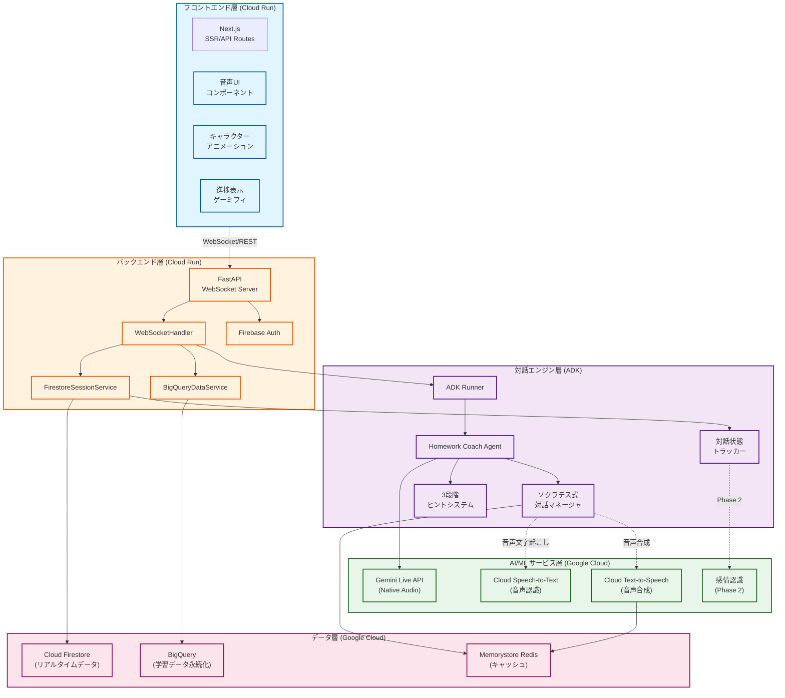
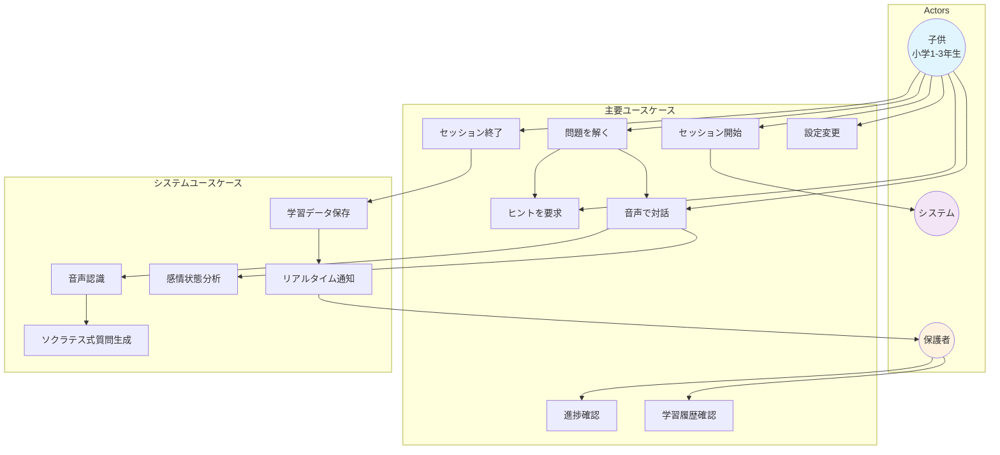
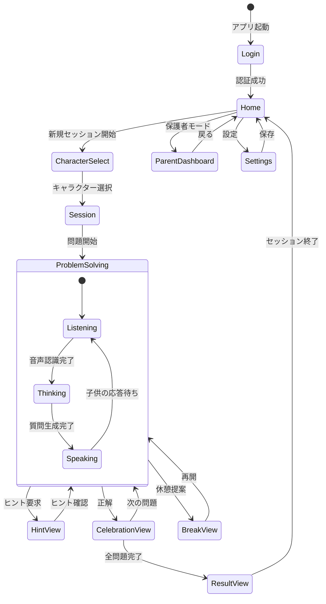
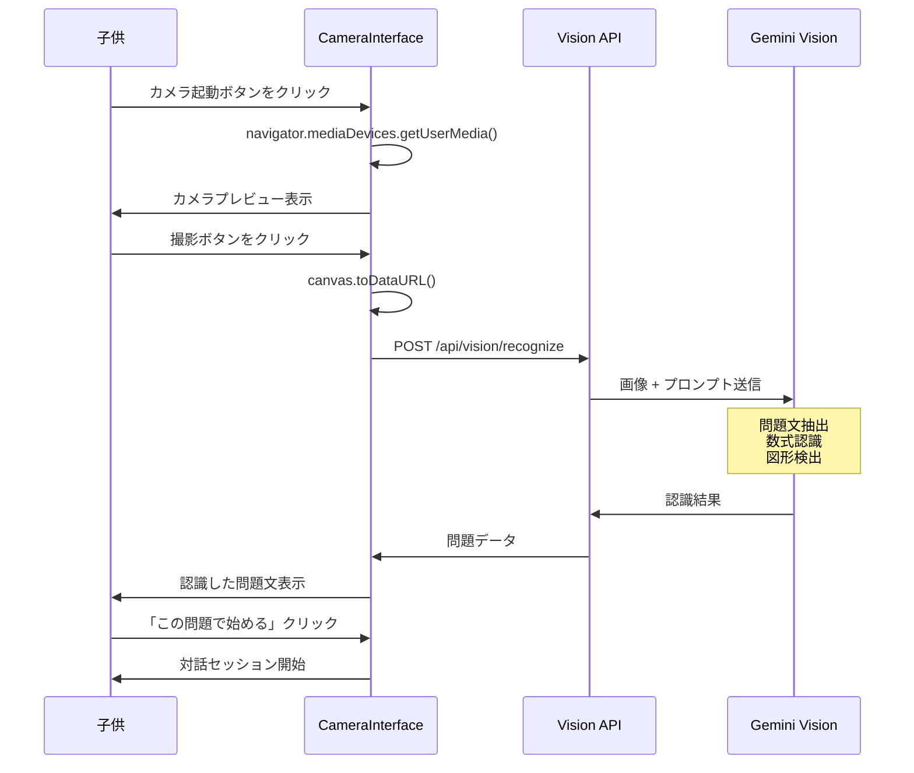
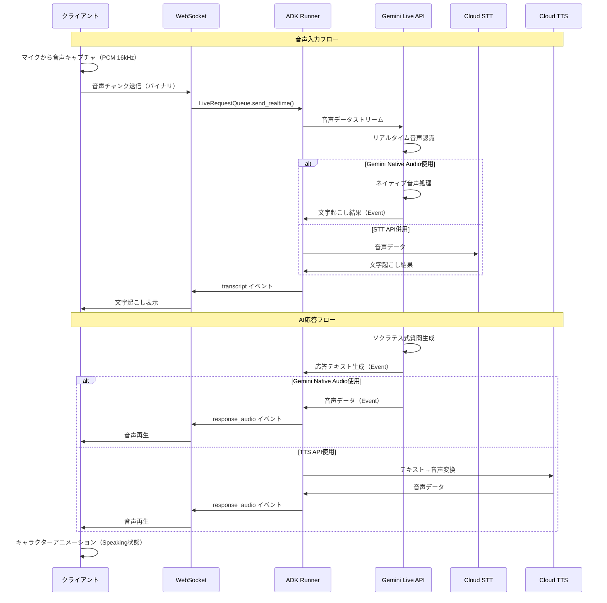
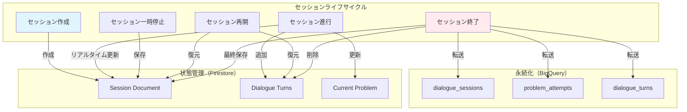
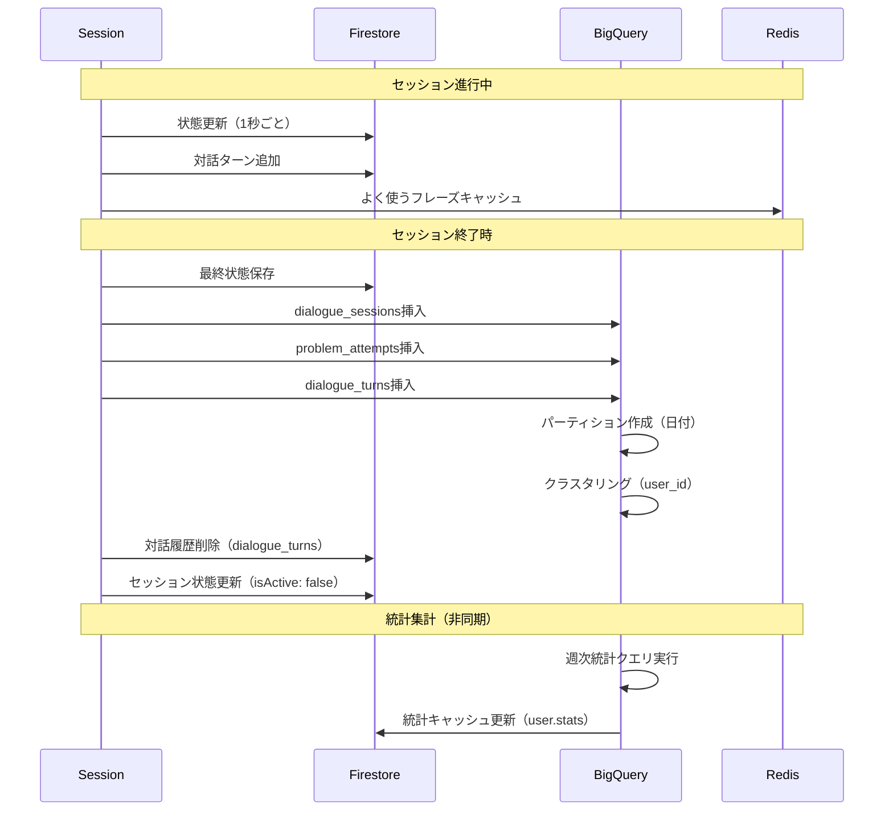
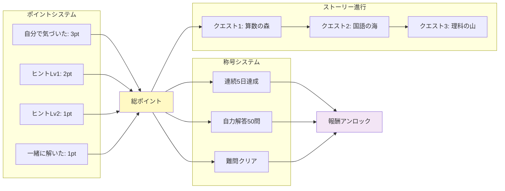
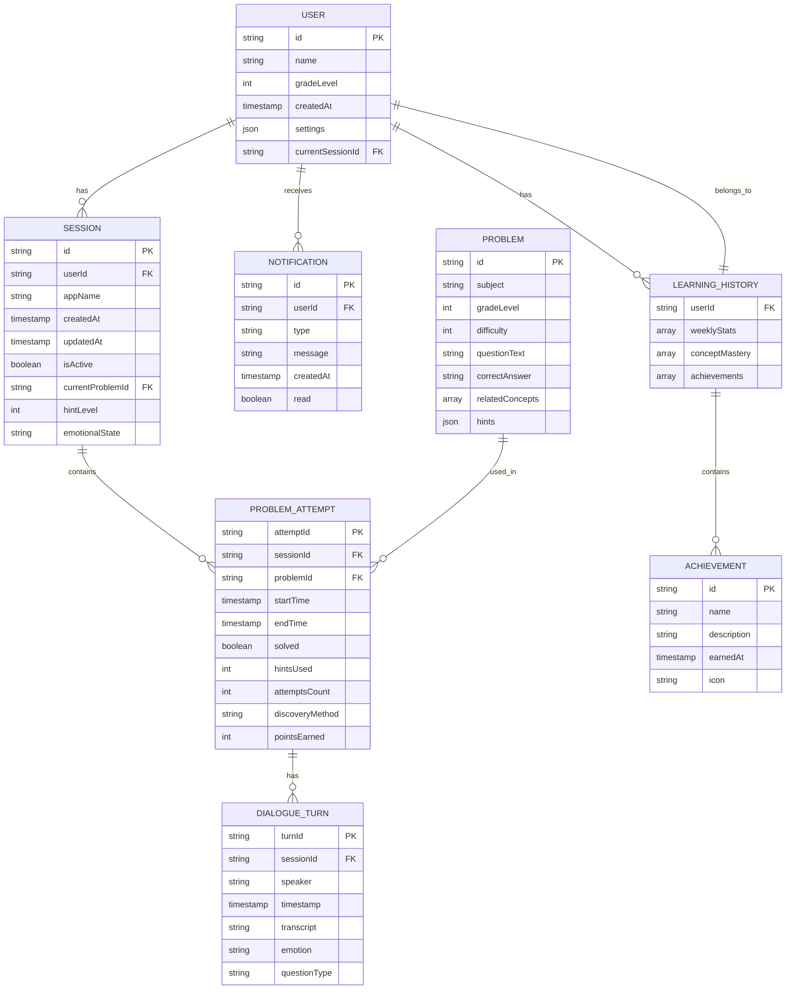

# 宿題コーチロボット - 機能設計書

**Document Version**: 1.4
**Last Updated**: 2026-01-29
**Status**: MVP設計完了

---

## 1. システムアーキテクチャ概要

### 1.1 全体構成



**主要な通信フロー:**

1. **音声入力フロー**: クライアント → WebSocket → ADK Runner → Gemini Live API
2. **音声出力フロー**: Gemini Live API → ADK Events → WebSocket → クライアント
3. **セッション管理**: SessionService ↔ Firestore（リアルタイム保存）
4. **学習データ永続化**: セッション終了時 → BigQueryDataService → BigQuery
5. **キャッシュ**: よく使うフレーズ・音声データ → Redis

**Cloud Run設定方針:**
- **フロントエンド**: 最小インスタンス0（コスト最適化）
- **バックエンド**: 最小インスタンス0（開発環境）、1（本番環境、WebSocket維持）

### 1.2 技術スタック（MVP）

**フロントエンド**
- フレームワーク: Next.js 14+ (App Router)
- ランタイム: Bun 1.0+（高速JavaScript/TypeScriptランタイム）
- 音声処理: Web Audio API (PCM 16kHz形式)
- WebSocket: ネイティブ WebSocket API
- アニメーション: Rive (https://rive.app/)
- 状態管理: Jotai（Atomic状態管理、App Router対応）
- デプロイ: Cloud Run (コンテナ)
- 静的アセット配信: Cloud Storage + Cloud CDN

**バックエンド（Google Cloud Platform）**
- ランタイム: Python 3.10+
- フレームワーク: FastAPI
- WebSocket: FastAPI WebSocket
- API: REST + WebSocket（双方向ストリーミング）
- デプロイ: Cloud Run

**AI/MLサービス（Google Cloud）**
- **LLM**: Google ADK (Agent Development Kit) + Gemini Live API
  - モデル: `gemini-2.5-flash-native-audio-preview`（ネイティブ音声対応）
  - SDK: `google-adk` (Python)
  - API: Vertex AI Live API
  - **マルチモーダル対応**: 音声 + 画像の同時処理
- **STT**: Cloud Speech-to-Text API
  - リアルタイムストリーミング認識
  - 日本語児童音声最適化
- **TTS**: Cloud Text-to-Speech API
  - WaveNet音声（自然な発話）
  - カスタム声質設定（励まし/説明/共感）
- **画像認識**: Gemini Vision + Cloud Vision API
  - OCR（手書き・印刷文字認識）
  - 数式認識
  - 図形・図表認識
  - 問題文の自動抽出
- **感情認識**: カスタムモデル（フェーズ2）
  - Vertex AI AutoML / Custom Training

**データ層（Google Cloud）**
- **セッション管理**: Cloud Firestore
  - リアルタイム同期
  - オフラインサポート
- **学習データ永続化**: BigQuery
  - 対話履歴の分析用データウェアハウス
  - ユーザー学習進捗の長期保存
  - 集計・分析クエリの高速実行
- **ユーザーデータ**: Cloud Firestore
  - ユーザープロフィール
  - 設定情報
  - リアルタイム進捗
- **キャッシュ**: Cloud Memorystore for Redis
  - よく使うフレーズの音声キャッシュ
  - セッション状態の一時保存
- **問題バンク**: Cloud Firestore Collections
  - 問題データの階層構造管理

**認証**
- Firebase Authentication
  - 子供アカウント管理
  - 保護者アカウント連携

**インフラ**
- **ホスティング**: Cloud Run（フロントエンド・バックエンド両方）
- **コンテナ**: Docker（Cloud Run用）
- **CI/CD**: Cloud Build + GitHub Actions
- **モニタリング**: Cloud Logging + Cloud Monitoring
- **環境変数**: Secret Manager

**開発環境**
- **フロントエンドパッケージ管理**: Bun（高速インストール・ビルトインツール）
- **バックエンドパッケージ管理**: uv（Rust製高速Pythonパッケージマネージャ）
- **主要依存関係**:
  - `google-adk>=1.20.0`
  - `fastapi>=0.115.0`
  - `google-cloud-speech>=2.20.0`
  - `google-cloud-texttospeech>=2.14.0`
  - `google-cloud-firestore>=2.11.0`
  - `google-cloud-bigquery>=3.10.0`
  - `python-dotenv>=1.0.0`

### 1.3 ADK 4フェーズライフサイクル

Google ADKのストリーミングアーキテクチャに基づく設計：

#### フェーズ1: アプリケーション初期化（起動時に1回）
```python
# Agent、SessionService、Runnerを作成
agent = Agent(
    name="homework_coach",
    model="gemini-2.5-flash-native-audio-preview",
    tools=[hint_system, problem_analyzer],
    instruction="ソクラテス式対話でヒントを提供"
)

session_service = FirestoreSessionService()  # Firestore実装
runner = Runner(
    app_name="homework-coach",
    agent=agent,
    session_service=session_service
)
```

#### フェーズ2: セッション初期化（ユーザー接続ごと）
```python
# セッション取得/作成
session = await session_service.get_session(
    app_name="homework-coach",
    user_id=user_id,
    session_id=session_id
)

# RunConfig設定
run_config = RunConfig(
    streaming_mode=StreamingMode.BIDI,
    response_modalities=["AUDIO"],
    input_audio_transcription=AudioTranscriptionConfig(),
    output_audio_transcription=AudioTranscriptionConfig(),
)

# LiveRequestQueue作成
live_request_queue = LiveRequestQueue()
```

#### フェーズ3: 双方向ストリーミング（アクティブな通信）
```python
# 上流タスク: クライアント → キュー
async def upstream_task():
    while True:
        message = await websocket.receive()
        if "bytes" in message:
            # 音声データをキューに送信
            audio_blob = Blob(
                mime_type="audio/pcm;rate=16000",
                data=message["bytes"]
            )
            live_request_queue.send_realtime(audio_blob)

# 下流タスク: イベント → クライアント
async def downstream_task():
    async for event in runner.run_live(
        user_id=user_id,
        session_id=session_id,
        live_request_queue=live_request_queue,
        run_config=run_config
    ):
        await websocket.send_text(event.model_dump_json())

# 並行実行
await asyncio.gather(upstream_task(), downstream_task())
```

#### フェーズ4: セッション終了
```python
finally:
    live_request_queue.close()
    # BigQueryに学習データを永続化
    await save_session_to_bigquery(session)
```

### 1.4 ユースケース図



**ユースケース詳細:**

| ID | ユースケース | アクター | 説明 | 優先度 |
|----|------------|---------|------|--------|
| UC1 | セッション開始 | 子供 | キャラクター選択、宿題開始 | 高 |
| UC2 | 問題を解く | 子供 | 問題を音声で読み上げ、回答 | 高 |
| UC3 | ヒントを要求 | 子供 | 3段階ヒントを順番に取得 | 高 |
| UC4 | 音声で対話 | 子供 | AIと音声で対話しながら考える | 高 |
| UC5 | セッション終了 | 子供 | 今日の結果を確認、ポイント獲得 | 高 |
| UC6 | 進捗確認 | 保護者 | 子供の学習状況をリアルタイム確認 | 中 |
| UC7 | 設定変更 | 子供/保護者 | キャラクター、音声速度等を変更 | 低 |
| UC8 | 学習履歴確認 | 保護者 | 過去の学習データ、分析結果を確認 | 中 |
| UC9 | 音声認識 | システム | 子供の音声をテキスト化 | 高 |
| UC10 | ソクラテス式質問生成 | システム | 答えを教えずに導く質問を生成 | 高 |
| UC11 | 感情状態分析 | システム | 音声トーンから感情を検知 | 中 |
| UC12 | 学習データ保存 | システム | セッション終了時にBigQueryに保存 | 高 |
| UC13 | リアルタイム通知 | システム | 保護者にセッション状況を通知 | 中 |

### 1.5 画面遷移図



**画面遷移の説明:**

1. **Login** → **Home**
   - Firebase Authenticationで認証
   - 初回はプロフィール設定

2. **Home** → **CharacterSelect**
   - セッション開始ボタンをクリック
   - キャラクター選択画面へ

3. **CharacterSelect** → **Session**
   - ロボット/魔法使い/宇宙飛行士/動物から選択
   - セッション画面に遷移

4. **Session** → **ProblemSolving**
   - AIが「今日は何の宿題？」と質問
   - 子供が問題を読み上げる

5. **ProblemSolving**（状態遷移）
   - Listening: 子供の音声を聞いている
   - Thinking: AIが考え中
   - Speaking: AIが質問/ヒントを話す

6. **ProblemSolving** → **HintView**
   - 宝箱アイコンをクリック
   - ヒント表示モーダル

7. **ProblemSolving** → **CelebrationView**
   - 正解時のアニメーション
   - ポイント獲得演出

8. **CelebrationView** → **ResultView**
   - 全問題完了時
   - 今日の成果を表示

9. **Home** → **ParentDashboard**
   - 保護者モードボタン
   - 子供の学習状況確認

### 1.6 ワイヤフレーム（主要画面）

#### 1.6.1 Home画面

```
┌─────────────────────────────────────┐
│  宿題コーチロボット          [設定] │
├─────────────────────────────────────┤
│                                     │
│      [キャラクターアイコン]         │
│                                     │
│      こんにちは、たろうくん！       │
│                                     │
│   ┌───────────────────────┐         │
│   │  今日の宿題をはじめる  │         │
│   └───────────────────────┘         │
│                                     │
│   ┌─────────┐  ┌─────────┐         │
│   │ 今日の  │  │ これまで│         │
│   │ ポイント│  │  の記録 │         │
│   │  120pt │  │  50問  │         │
│   └─────────┘  └─────────┘         │
│                                     │
│   [保護者の方はこちら]              │
│                                     │
└─────────────────────────────────────┘
```

#### 1.6.2 Session画面（音声対話中）

```
┌─────────────────────────────────────┐
│  [戻る]              問題 1/5  [×] │
├─────────────────────────────────────┤
│                                     │
│        ┌─────────────┐              │
│        │             │              │
│        │ キャラクター│              │
│        │ アニメーション│              │
│        │  (Speaking) │              │
│        │             │              │
│        └─────────────┘              │
│                                     │
│   「この問題、何を聞いてると思う？」 │
│                                     │
│   ┌─────────────────────┐           │
│   │                     │           │
│   │  音声レベル表示      │           │
│   │  [━━━━━━    ]      │           │
│   │                     │           │
│   └─────────────────────┘           │
│                                     │
│   [ヒントを見る]  [休憩する]        │
│                                     │
│   使ったヒント: 0/3                 │
│   獲得ポイント: +5pt                │
│                                     │
└─────────────────────────────────────┘
```

#### 1.6.3 HintView（宝箱演出）

```
┌─────────────────────────────────────┐
│             ヒント                  │
├─────────────────────────────────────┤
│                                     │
│                                     │
│        ┌─────────────┐              │
│        │             │              │
│        │   宝箱      │              │
│        │ アニメーション│              │
│        │  (Opening)  │              │
│        │             │              │
│        └─────────────┘              │
│                                     │
│      キラキラ ✨ キラキラ ✨         │
│                                     │
│   ┌─────────────────────────┐       │
│   │ ヒント 1                │       │
│   │                         │       │
│   │ この問題は何について    │       │
│   │ 聞いていますか？        │       │
│   │                         │       │
│   └─────────────────────────┘       │
│                                     │
│        [次のヒント]  [閉じる]       │
│                                     │
└─────────────────────────────────────┘
```

#### 1.6.4 ResultView（セッション終了）

```
┌─────────────────────────────────────┐
│          今日の成果！               │
├─────────────────────────────────────┤
│                                     │
│    ┌─────────────────┐              │
│    │  キャラクター    │              │
│    │  (Celebrating)  │              │
│    │   よくできたね！ │              │
│    └─────────────────┘              │
│                                     │
│   ┌─────────────────────────┐       │
│   │ 解いた問題: 5問          │       │
│   │ 自分で気づいた: 3問 ⭐    │       │
│   │ ヒントで解いた: 2問      │       │
│   │                         │       │
│   │ 獲得ポイント: +25pt 🎉  │       │
│   └─────────────────────────┘       │
│                                     │
│   ┌─────────────────────────┐       │
│   │ 今日のすごいところ！     │       │
│   │                         │       │
│   │ ✅ 最初から最後まで     │       │
│   │    あきらめなかった！   │       │
│   │                         │       │
│   │ ✅ むずかしい問題でも   │       │
│   │    自分で考えた！       │       │
│   └─────────────────────────┘       │
│                                     │
│        [おわる]  [もっとやる]       │
│                                     │
└─────────────────────────────────────┘
```

#### 1.6.5 ParentDashboard（保護者画面）

```
┌─────────────────────────────────────┐
│  保護者ダッシュボード    [ログアウト]│
├─────────────────────────────────────┤
│                                     │
│  たろうくんの学習状況               │
│                                     │
│  ┌─────────────────────────┐        │
│  │ 今週の学習                │        │
│  │                          │        │
│  │ セッション数: 5回         │        │
│  │ 解いた問題: 25問          │        │
│  │ 自力解答率: 60%          │        │
│  │                          │        │
│  │ [週]  [月]  [全期間]    │        │
│  └─────────────────────────┘        │
│                                     │
│  ┌─────────────────────────┐        │
│  │ つまずきポイント          │        │
│  │                          │        │
│  │ 🔸 繰り上がりの計算      │        │
│  │   (3回つまずき)         │        │
│  │                          │        │
│  │ 🔸 文章題の理解          │        │
│  │   (2回つまずき)         │        │
│  └─────────────────────────┘        │
│                                     │
│  ┌─────────────────────────┐        │
│  │ 最近の活動               │        │
│  │                          │        │
│  │ 📅 今日 17:30           │        │
│  │    算数5問クリア！       │        │
│  │    自分で3問解いた ⭐    │        │
│  │                          │        │
│  │ 📅 昨日 18:00           │        │
│  │    国語3問クリア         │        │
│  └─────────────────────────┘        │
│                                     │
│         [詳細レポートを見る]        │
│                                     │
└─────────────────────────────────────┘
```

#### 1.6.6 CameraView（写真で問題認識）

**状態1: カメラ起動前**
```
┌─────────────────────────────────────┐
│  [戻る]      問題を選ぶ             │
├─────────────────────────────────────┤
│                                     │
│        ┌─────────────┐              │
│        │             │              │
│        │ キャラクター│              │
│        │             │              │
│        └─────────────┘              │
│                                     │
│     問題をどうやって教える？         │
│                                     │
│   ┌─────────────────────┐           │
│   │  🎤 声で伝える       │           │
│   └─────────────────────┘           │
│                                     │
│   ┌─────────────────────┐           │
│   │  📷 写真で伝える     │           │
│   └─────────────────────┘           │
│                                     │
│                                     │
└─────────────────────────────────────┘
```

**状態2: カメラプレビュー**
```
┌─────────────────────────────────────┐
│  [×]              カメラ            │
├─────────────────────────────────────┤
│                                     │
│  ┌─────────────────────────────┐    │
│  │                             │    │
│  │                             │    │
│  │      カメラプレビュー        │    │
│  │      (リアルタイム映像)      │    │
│  │                             │    │
│  │    ┌─────────────────┐      │    │
│  │    │  問題全体が入る  │      │    │
│  │    │  ように撮影して  │      │    │
│  │    │   ください      │      │    │
│  │    └─────────────────┘      │    │
│  │                             │    │
│  │                             │    │
│  └─────────────────────────────┘    │
│                                     │
│        ┌─────────────┐              │
│        │  📸 撮影する │              │
│        └─────────────┘              │
│                                     │
└─────────────────────────────────────┘
```

**状態3: 画像処理中**
```
┌─────────────────────────────────────┐
│            問題を認識中...          │
├─────────────────────────────────────┤
│                                     │
│  ┌─────────────────────────────┐    │
│  │                             │    │
│  │                             │    │
│  │      撮影した画像            │    │
│  │                             │    │
│  │                             │    │
│  └─────────────────────────────┘    │
│                                     │
│            ⏳ 処理中...             │
│                                     │
│         問題を認識しています         │
│                                     │
│    ━━━━━━━━━━━━━━━━━━━━            │
│                                     │
└─────────────────────────────────────┘
```

**状態4: 認識結果表示**
```
┌─────────────────────────────────────┐
│  [×]          認識結果              │
├─────────────────────────────────────┤
│                                     │
│  ┌─────────────────────────────┐    │
│  │                             │    │
│  │      撮影した画像            │    │
│  │                             │    │
│  └─────────────────────────────┘    │
│                                     │
│  ┌─────────────────────────────┐    │
│  │ 認識した問題文:              │    │
│  │                             │    │
│  │ 5 + 3 = ?                   │    │
│  │                             │    │
│  │ この問題は算数の             │    │
│  │ たし算の問題です             │    │
│  └─────────────────────────────┘    │
│                                     │
│   ┌────────────┐  ┌────────────┐    │
│   │ この問題で │  │  撮り直す │    │
│   │  始める   │  │           │    │
│   └────────────┘  └────────────┘    │
│                                     │
└─────────────────────────────────────┘
```

**状態5: 認識エラー**
```
┌─────────────────────────────────────┐
│  [×]            エラー              │
├─────────────────────────────────────┤
│                                     │
│  ┌─────────────────────────────┐    │
│  │                             │    │
│  │      撮影した画像            │    │
│  │      (ぼやけている)          │    │
│  │                             │    │
│  └─────────────────────────────┘    │
│                                     │
│        ⚠️ 問題を認識できませんでした  │
│                                     │
│  ┌─────────────────────────────┐    │
│  │ もう一度、以下を試してください:│    │
│  │                             │    │
│  │ ✓ 問題全体が写るように       │    │
│  │ ✓ 明るい場所で撮影           │    │
│  │ ✓ 文字がはっきり見えるように │    │
│  └─────────────────────────────┘    │
│                                     │
│   ┌────────────┐  ┌────────────┐    │
│   │ もう一度  │  │ 声で伝える │    │
│   │  撮影する │  │           │    │
│   └────────────┘  └────────────┘    │
│                                     │
└─────────────────────────────────────┘
```

---

## 2. コンポーネント設計

### 2.1 フロントエンドコンポーネント

#### 2.1.1 VoiceInterface
音声の録音・再生を管理

**責務**
- マイクからの音声入力キャプチャ
- 音声データのストリーミング送信
- 受信した音声の再生
- 音声レベルの可視化

**状態**
- `isRecording: boolean`
- `isPlaying: boolean`
- `audioLevel: number`
- `connectionStatus: 'connected' | 'disconnected' | 'connecting'`

**API**
```typescript
interface VoiceInterfaceProps {
  onAudioData: (audioBlob: Blob) => void;
  onTranscriptReceived: (text: string) => void;
  onResponseAudioReceived: (audioUrl: string) => void;
}
```

#### 2.1.2 CharacterAvatar（Rive実装）
キャラクターの表示とインタラクティブアニメーション

**責務**
- キャラクターの表情・動きの表示
- 対話状態に応じたアニメーション
- リップシンク（音声に合わせた口の動き）
- 音声レベルに応じた反応

**Rive アニメーション実装**

```typescript
'use client';

import { useRive, useStateMachineInput } from '@rive-app/react-canvas';
import { useEffect } from 'react';

interface CharacterAvatarProps {
  characterType: 'robot' | 'wizard' | 'astronaut' | 'animal';
  emotionalState: 'neutral' | 'thinking' | 'excited' | 'encouraging';
  isSpeaking: boolean;
  audioLevel: number; // 0-100
}

export function CharacterAvatar({
  characterType,
  emotionalState,
  isSpeaking,
  audioLevel
}: CharacterAvatarProps) {
  // Riveファイルをロード（.rivファイル）
  const { rive, RiveComponent } = useRive({
    src: `/characters/${characterType}.riv`,
    stateMachines: 'State Machine 1',
    autoplay: true,
  });

  // ステートマシンの入力を取得
  const emotionInput = useStateMachineInput(rive, 'State Machine 1', 'emotion');
  const speakingInput = useStateMachineInput(rive, 'State Machine 1', 'isSpeaking');
  const audioLevelInput = useStateMachineInput(rive, 'State Machine 1', 'audioLevel');

  // 状態変化時にRiveアニメーションを更新
  useEffect(() => {
    if (emotionInput) {
      emotionInput.value = getEmotionValue(emotionalState);
    }
  }, [emotionalState, emotionInput]);

  useEffect(() => {
    if (speakingInput) {
      speakingInput.value = isSpeaking;
    }
  }, [isSpeaking, speakingInput]);

  useEffect(() => {
    if (audioLevelInput) {
      audioLevelInput.value = audioLevel;
    }
  }, [audioLevel, audioLevelInput]);

  return (
    <div className="character-container">
      <RiveComponent className="character-avatar" />
    </div>
  );
}

function getEmotionValue(emotion: string): number {
  const emotionMap = {
    neutral: 0,
    thinking: 1,
    excited: 2,
    encouraging: 3,
  };
  return emotionMap[emotion] || 0;
}
```

**Rive ステートマシン設計**

Riveエディタで以下のステートマシンを作成：

```
State Machine 1
├─ 入力（Inputs）
│  ├─ emotion (Number: 0-3)
│  ├─ isSpeaking (Boolean)
│  └─ audioLevel (Number: 0-100)
│
├─ 状態（States）
│  ├─ Idle
│  ├─ Listening
│  ├─ Thinking
│  ├─ Speaking
│  └─ Celebrating
│
└─ 遷移（Transitions）
   ├─ Idle → Listening (emotion == 0)
   ├─ Listening → Thinking (emotion == 1)
   ├─ Thinking → Speaking (isSpeaking == true)
   ├─ Speaking → Idle (isSpeaking == false)
   └─ Any → Celebrating (emotion == 2)
```

**アニメーションパターン詳細**

| 状態 | トリガー | アニメーション | Rive実装 |
|------|---------|---------------|----------|
| **Idle** | 待機中 | ゆっくり呼吸、まばたき | Idle状態のアニメーション |
| **Listening** | 子供が話している | 耳を傾ける、頷く | audioLevelに応じて頭が動く |
| **Thinking** | AIが考え中 | 頭を傾げる、「うーん」 | Thinkingアニメーション、ループ |
| **Speaking** | AIが話している | 口パク、表情変化 | audioLevelで口の開き具合を制御 |
| **Celebrating** | 正解・褒める | ジャンプ、拍手、キラキラ | Celebratingアニメーション再生 |

**リップシンク実装**

```typescript
// 音声レベルをRiveに送信してリップシンクを実現
useEffect(() => {
  if (!isSpeaking) return;

  // Web Audio APIで音声レベルを取得
  const analyser = audioContext.createAnalyser();
  analyser.fftSize = 256;
  const dataArray = new Uint8Array(analyser.frequencyBinCount);

  const updateAudioLevel = () => {
    analyser.getByteFrequencyData(dataArray);
    const average = dataArray.reduce((a, b) => a + b) / dataArray.length;
    const normalizedLevel = (average / 255) * 100;

    // RiveのaudioLevel入力を更新
    if (audioLevelInput) {
      audioLevelInput.value = normalizedLevel;
    }

    if (isSpeaking) {
      requestAnimationFrame(updateAudioLevel);
    }
  };

  updateAudioLevel();
}, [isSpeaking, audioContext, audioLevelInput]);
```

**Riveファイル構成**

```
public/characters/
├── robot.riv          # ロボットキャラクター
├── wizard.riv         # 魔法使いキャラクター
├── astronaut.riv      # 宇宙飛行士キャラクター
└── animal.riv         # 動物キャラクター

各.rivファイルには：
- 複数の感情状態のアニメーション
- ステートマシンでの状態遷移
- 音声レベルに応じた口の動き
- アイドル時の自動アニメーション
```

**Riveの利点（このプロジェクトでの選択理由）**

1. **ステートマシンによるインタラクティブ制御**
   - 対話状態に応じた自動遷移
   - コードから状態を制御しやすい

2. **ファイルサイズが小さい**
   - .rivファイル: 50-200KB
   - Lottie JSON: 500KB-2MB
   - 約1/10のサイズ

3. **リアルタイムレンダリング**
   - 音声レベルに応じた動的制御
   - リップシンクの実装が容易

4. **React公式サポート**
   - `@rive-app/react-canvas`
   - `@rive-app/react-webgl`（高度な演出用）

5. **クロスプラットフォーム**
   - Web、iOS、Android、Unity、Unreal
   - 将来的なモバイルアプリ展開が容易

#### 2.1.3 HintBox（Rive実装）
ヒントの表示とインタラクティブアニメーション

**責務**
- 3段階ヒントの表示
- 「宝箱を開ける」演出（Riveアニメーション）
- ヒント使用回数の表示

**Rive実装**

```typescript
'use client';

import { useRive, useStateMachineInput } from '@rive-app/react-canvas';
import { useState } from 'react';

interface HintBoxProps {
  hintLevel: 0 | 1 | 2 | 3;
  hintText: string;
  onHintRequest: () => void;
  hintsUsed: number;
}

export function HintBox({ hintLevel, hintText, onHintRequest, hintsUsed }: HintBoxProps) {
  const [isOpening, setIsOpening] = useState(false);

  const { rive, RiveComponent } = useRive({
    src: '/animations/treasure-chest.riv',
    stateMachines: 'Chest State Machine',
    autoplay: true,
  });

  const openTrigger = useStateMachineInput(rive, 'Chest State Machine', 'open');
  const sizeInput = useStateMachineInput(rive, 'Chest State Machine', 'size');

  const handleOpenChest = () => {
    setIsOpening(true);

    // 宝箱のサイズを設定（ヒントレベルに応じて）
    if (sizeInput) {
      sizeInput.value = hintLevel;
    }

    // 開くアニメーションをトリガー
    if (openTrigger) {
      openTrigger.fire();
    }

    // アニメーション完了後にヒント表示
    setTimeout(() => {
      onHintRequest();
      setIsOpening(false);
    }, 1500); // Riveアニメーションの長さに合わせる
  };

  return (
    <div className="hint-box">
      {!isOpening && hintLevel === 0 && (
        <button onClick={handleOpenChest} className="treasure-button">
          <RiveComponent className="treasure-chest" />
          <span>ヒントを見る</span>
        </button>
      )}

      {isOpening && (
        <div className="opening-animation">
          <RiveComponent className="treasure-chest-opening" />
        </div>
      )}

      {hintLevel > 0 && hintText && (
        <div className="hint-content">
          <div className="hint-badge">ヒント {hintLevel}</div>
          <p>{hintText}</p>
          {hintLevel < 3 && (
            <button onClick={handleOpenChest} className="next-hint-button">
              次のヒント
            </button>
          )}
        </div>
      )}

      <div className="hints-counter">
        使ったヒント: {hintsUsed}/3
      </div>
    </div>
  );
}
```

**Rive ステートマシン設計（宝箱）**

```
Chest State Machine
├─ 入力（Inputs）
│  ├─ open (Trigger)
│  └─ size (Number: 1-3)
│
├─ 状態（States）
│  ├─ Idle (閉じた宝箱)
│  ├─ Opening (開くアニメーション)
│  ├─ Opened (開いた状態、キラキラ)
│  └─ Closed (再び閉じる)
│
└─ 遷移（Transitions）
   ├─ Idle → Opening (open triggered)
   ├─ Opening → Opened (animation complete)
   └─ Opened → Idle (after 2 seconds)
```

**アニメーション演出詳細**

| レベル | 宝箱サイズ | 色 | エフェクト |
|--------|-----------|-----|-----------|
| **レベル1** | 小 | ブロンズ | 小さなキラキラ |
| **レベル2** | 中 | シルバー | 中程度のキラキラ |
| **レベル3** | 大 | ゴールド | 大きなキラキラ + 光の柱 |

**Riveファイル構成**

```
public/animations/
├── treasure-chest.riv    # 宝箱アニメーション
│   ├─ Small Chest (Level 1)
│   ├─ Medium Chest (Level 2)
│   └─ Large Chest (Level 3)
└── sparkles.riv          # キラキラエフェクト（オプション）
```

#### 2.1.4 ProgressTracker
学習進捗の可視化

**責務**
- 今日の進捗表示
- 獲得ポイントの表示
- ストーリー進行の表示

**表示項目**
- 解いた問題数
- 自力解答数
- 獲得ポイント
- 現在のストーリー位置

#### 2.1.5 CameraInterface
写真による問題認識機能

**責務**
- カメラ起動・写真撮影
- 画像のプレビュー表示
- 画像データの送信
- OCR結果の表示
- 認識エラーのハンドリング

**状態**
- `isCameraActive: boolean`
- `capturedImage: string | null`
- `isProcessing: boolean`
- `recognizedText: string | null`
- `recognitionError: string | null`

**実装**

```typescript
'use client';

import { useState, useRef } from 'react';

interface CameraInterfaceProps {
  onImageCaptured: (imageData: string) => void;
  onTextRecognized: (text: string, problemData: ProblemData) => void;
  onError: (error: string) => void;
}

interface ProblemData {
  problemText: string;
  problemType: 'math' | 'reading' | 'writing';
  detectedEquations?: string[];
  detectedDiagrams?: boolean;
}

export function CameraInterface({
  onImageCaptured,
  onTextRecognized,
  onError
}: CameraInterfaceProps) {
  const [isCameraActive, setIsCameraActive] = useState(false);
  const [capturedImage, setCapturedImage] = useState<string | null>(null);
  const [isProcessing, setIsProcessing] = useState(false);
  const [recognizedText, setRecognizedText] = useState<string | null>(null);

  const videoRef = useRef<HTMLVideoElement>(null);
  const canvasRef = useRef<HTMLCanvasElement>(null);

  // カメラを起動
  const startCamera = async () => {
    try {
      const stream = await navigator.mediaDevices.getUserMedia({
        video: {
          facingMode: 'environment', // 背面カメラを優先
          width: { ideal: 1920 },
          height: { ideal: 1080 }
        }
      });

      if (videoRef.current) {
        videoRef.current.srcObject = stream;
        setIsCameraActive(true);
      }
    } catch (error) {
      onError('カメラの起動に失敗しました。カメラの権限を確認してください。');
    }
  };

  // 写真を撮影
  const capturePhoto = () => {
    if (!videoRef.current || !canvasRef.current) return;

    const video = videoRef.current;
    const canvas = canvasRef.current;
    const context = canvas.getContext('2d');

    if (!context) return;

    // キャンバスにビデオフレームを描画
    canvas.width = video.videoWidth;
    canvas.height = video.videoHeight;
    context.drawImage(video, 0, 0);

    // Base64形式で画像データを取得
    const imageData = canvas.toDataURL('image/jpeg', 0.9);
    setCapturedImage(imageData);
    onImageCaptured(imageData);

    // カメラストリームを停止
    const stream = video.srcObject as MediaStream;
    stream?.getTracks().forEach(track => track.stop());
    setIsCameraActive(false);

    // 画像認識処理を開始
    processImage(imageData);
  };

  // 画像認識処理
  const processImage = async (imageData: string) => {
    setIsProcessing(true);

    try {
      const response = await fetch('/api/vision/recognize', {
        method: 'POST',
        headers: {
          'Content-Type': 'application/json',
        },
        body: JSON.stringify({
          image: imageData,
          recognitionType: 'homework_problem'
        })
      });

      if (!response.ok) {
        throw new Error('画像認識に失敗しました');
      }

      const result = await response.json();

      setRecognizedText(result.problemText);
      onTextRecognized(result.problemText, {
        problemText: result.problemText,
        problemType: result.problemType,
        detectedEquations: result.equations,
        detectedDiagrams: result.hasDiagrams
      });

    } catch (error) {
      onError('問題の認識に失敗しました。もう一度撮影してください。');
    } finally {
      setIsProcessing(false);
    }
  };

  // 再撮影
  const retakePhoto = () => {
    setCapturedImage(null);
    setRecognizedText(null);
    startCamera();
  };

  return (
    <div className="camera-interface">
      {!isCameraActive && !capturedImage && (
        <button onClick={startCamera} className="start-camera-button">
          📷 写真で問題を認識する
        </button>
      )}

      {isCameraActive && (
        <div className="camera-view">
          <video
            ref={videoRef}
            autoPlay
            playsInline
            className="camera-video"
          />
          <div className="camera-overlay">
            <div className="capture-guide">
              問題全体が入るように撮影してください
            </div>
          </div>
          <button onClick={capturePhoto} className="capture-button">
            撮影する
          </button>
        </div>
      )}

      {capturedImage && (
        <div className="image-preview">
          

          {isProcessing && (
            <div className="processing-overlay">
              <div className="spinner" />
              <p>問題を認識しています...</p>
            </div>
          )}

          {recognizedText && !isProcessing && (
            <div className="recognition-result">
              <h3>認識した問題文:</h3>
              <p className="recognized-text">{recognizedText}</p>
              <div className="action-buttons">
                <button onClick={() => {/* 認識結果を確定 */}} className="confirm-button">
                  この問題で始める
                </button>
                <button onClick={retakePhoto} className="retake-button">
                  撮り直す
                </button>
              </div>
            </div>
          )}
        </div>
      )}

      <canvas ref={canvasRef} style={{ display: 'none' }} />
    </div>
  );
}
```

**画像認識の流れ**



**Gemini Vision プロンプト設計**

```python
# バックエンド: /api/vision/recognize エンドポイント
VISION_PROMPT = """
あなたは小学校低学年（1〜3年生）の宿題問題を認識するAIです。
画像から以下の情報を抽出してください：

1. **問題文**: 画像に書かれている問題の文章を正確に読み取ってください
2. **問題タイプ**: 算数/国語/その他を判定してください
3. **数式**: 数式が含まれている場合は、LaTeX形式で抽出してください
4. **図形**: 図形や図表が含まれているかを判定してください

出力形式（JSON）：
{
  "problemText": "問題文全体",
  "problemType": "math" | "reading" | "writing",
  "equations": ["2 + 3 = ?", "x + 5 = 10"],
  "hasDiagrams": true | false,
  "confidence": 0.95
}

注意事項：
- 手書き文字も正確に読み取ってください
- 漢字にはルビ（ふりがな）が振られている場合があります
- 問題番号（1. 2. など）は含めないでください
"""

async def recognize_homework_problem(image_data: str) -> dict:
    """Gemini Visionで宿題問題を認識"""
    import base64
    from google import genai

    # Base64デコード
    image_bytes = base64.b64decode(image_data.split(',')[1])

    # Gemini Vision呼び出し
    client = genai.Client(api_key=os.getenv('GEMINI_API_KEY'))
    response = client.models.generate_content(
        model='gemini-2.0-flash-exp',
        contents=[
            VISION_PROMPT,
            {
                'inline_data': {
                    'mime_type': 'image/jpeg',
                    'data': base64.b64encode(image_bytes).decode()
                }
            }
        ]
    )

    # JSON解析
    result = json.loads(response.text)
    return result
```

**UI/UX設計**

| 状態 | 表示 | 操作 |
|------|------|------|
| **初期状態** | 「📷 写真で問題を認識する」ボタン | ボタンをタップしてカメラ起動 |
| **カメラアクティブ** | リアルタイムプレビュー + ガイド線 | 「撮影する」ボタン |
| **画像処理中** | スピナー + 「問題を認識しています...」 | （待機） |
| **認識完了** | 認識した問題文 + 確認/撮り直しボタン | 確認して対話開始 or 撮り直し |
| **認識エラー** | エラーメッセージ + 撮り直しボタン | 撮り直し |

**エラーハンドリング**

```typescript
interface RecognitionError {
  type: 'camera_permission' | 'recognition_failed' | 'low_confidence' | 'network_error';
  message: string;
  suggestions: string[];
}

const ERROR_MESSAGES = {
  camera_permission: {
    message: 'カメラの権限が必要です',
    suggestions: [
      'ブラウザの設定でカメラを許可してください',
      '音声入力に切り替えることもできます'
    ]
  },
  recognition_failed: {
    message: '問題を認識できませんでした',
    suggestions: [
      '問題全体が写るように撮影してください',
      '明るい場所で撮影してください',
      '手書き文字ははっきりと書いてください'
    ]
  },
  low_confidence: {
    message: '問題の認識に自信がありません',
    suggestions: [
      '認識した内容を確認してください',
      '正しくない場合は撮り直してください'
    ]
  },
  network_error: {
    message: 'ネットワークエラーが発生しました',
    suggestions: [
      'インターネット接続を確認してください',
      'もう一度試してください'
    ]
  }
};
```

**パフォーマンス最適化**

- **画像圧縮**: JPEG品質90%、最大1920x1080px
- **プログレッシブ処理**: 低解像度プレビュー → 高精度認識
- **キャッシュ**: 同じ画像の再認識を防止
- **タイムアウト**: 10秒以内に応答がない場合はエラー

**アクセシビリティ**

- カメラ非対応デバイスでは音声入力のみ表示
- ファイルアップロードの代替手段を提供
- 認識結果の読み上げ機能

### 2.2 バックエンドサービス

#### 2.2.1 FirestoreSessionService
ADKのSessionServiceインターフェースを実装したFirestoreベースのセッション管理

**責務**
- ADK Sessionの永続化（Firestore）
- セッションの取得・作成
- 対話履歴のリアルタイム保存

**実装**
```python
from google.adk.sessions import SessionService
from google.cloud import firestore

class FirestoreSessionService(SessionService):
    def __init__(self):
        self.db = firestore.AsyncClient()
        self.collection = "sessions"

    async def get_session(
        self, app_name: str, user_id: str, session_id: str
    ) -> Session | None:
        """Firestoreからセッションを取得"""
        doc_ref = self.db.collection(self.collection).document(session_id)
        doc = await doc_ref.get()

        if doc.exists:
            return Session.from_dict(doc.to_dict())
        return None

    async def create_session(
        self, app_name: str, user_id: str, session_id: str
    ) -> Session:
        """新規セッションをFirestoreに作成"""
        session = Session(
            id=session_id,
            user_id=user_id,
            app_name=app_name,
            created_at=firestore.SERVER_TIMESTAMP
        )

        doc_ref = self.db.collection(self.collection).document(session_id)
        await doc_ref.set(session.to_dict())

        return session

    async def save_session(self, session: Session) -> None:
        """セッション状態をFirestoreに保存"""
        doc_ref = self.db.collection(self.collection).document(session.id)
        await doc_ref.update(session.to_dict())
```

**Firestoreデータ構造**
```
sessions/{session_id}
  ├─ id: string
  ├─ user_id: string
  ├─ app_name: string
  ├─ created_at: timestamp
  ├─ updated_at: timestamp
  ├─ current_problem_id: string | null
  ├─ dialogue_history: array
  ├─ emotional_state: string
  └─ hint_level: number
```

#### 2.2.2 BigQueryDataService
学習データの永続化とクエリ

**責務**
- セッション終了時に学習データをBigQueryに保存
- 学習進捗の集計・分析
- ユーザー別の習熟度レポート生成

**実装**
```python
from google.cloud import bigquery
from datetime import datetime

class BigQueryDataService:
    def __init__(self):
        self.client = bigquery.Client()
        self.dataset_id = "homework_coach"

    async def save_session_data(self, session_data: dict) -> None:
        """セッションデータをBigQueryに保存"""
        table_id = f"{self.dataset_id}.dialogue_sessions"

        rows_to_insert = [{
            "session_id": session_data["id"],
            "user_id": session_data["user_id"],
            "start_time": session_data["start_time"],
            "end_time": datetime.utcnow().isoformat(),
            "problems_attempted": session_data["problems"],
            "total_points": session_data["total_points"],
            "dialogue_turns": session_data["dialogue_history"],
            "created_at": datetime.utcnow()
        }]

        errors = self.client.insert_rows_json(table_id, rows_to_insert)
        if errors:
            raise Exception(f"BigQuery insert errors: {errors}")

    async def get_user_stats(self, user_id: str, days: int = 7) -> dict:
        """ユーザーの学習統計を取得"""
        query = f"""
            SELECT
                COUNT(DISTINCT session_id) as sessions_count,
                SUM(total_points) as total_points,
                AVG(
                    ARRAY_LENGTH(
                        JSON_EXTRACT_ARRAY(problems_attempted, '$')
                    )
                ) as avg_problems_per_session,
                SUM(
                    (SELECT COUNT(*)
                     FROM UNNEST(JSON_EXTRACT_ARRAY(problems_attempted, '$'))
                     WHERE JSON_EXTRACT_SCALAR(problem, '$.discovery_method') = 'self')
                ) as self_discovery_count
            FROM `{self.dataset_id}.dialogue_sessions`
            WHERE user_id = @user_id
                AND start_time >= TIMESTAMP_SUB(CURRENT_TIMESTAMP(), INTERVAL @days DAY)
        """

        job_config = bigquery.QueryJobConfig(
            query_parameters=[
                bigquery.ScalarQueryParameter("user_id", "STRING", user_id),
                bigquery.ScalarQueryParameter("days", "INT64", days),
            ]
        )

        results = self.client.query(query, job_config=job_config).result()
        return next(results)
```

#### 2.2.3 WebSocketHandler
WebSocket接続とADK統合

**責務**
- WebSocket接続の確立と管理
- 上流タスク（クライアント → LiveRequestQueue）
- 下流タスク（ADK Events → クライアント）

**実装**
```python
from fastapi import WebSocket, WebSocketDisconnect
import asyncio

class WebSocketHandler:
    def __init__(self, runner: Runner, bigquery_service: BigQueryDataService):
        self.runner = runner
        self.bigquery_service = bigquery_service

    async def handle_connection(
        self,
        websocket: WebSocket,
        user_id: str,
        session_id: str,
        run_config: RunConfig
    ):
        """WebSocket接続を処理"""
        await websocket.accept()

        live_request_queue = LiveRequestQueue()

        try:
            # 並行タスク実行
            await asyncio.gather(
                self._upstream_task(websocket, live_request_queue),
                self._downstream_task(
                    websocket, user_id, session_id,
                    live_request_queue, run_config
                )
            )
        except WebSocketDisconnect:
            logger.info(f"Client disconnected: {session_id}")
        finally:
            live_request_queue.close()
            # セッション終了時にBigQueryに保存
            await self._save_session_to_bigquery(session_id)

    async def _upstream_task(
        self, websocket: WebSocket, queue: LiveRequestQueue
    ):
        """音声データをキューに送信"""
        while True:
            message = await websocket.receive()

            if "bytes" in message:
                # PCM音声データ
                audio_blob = types.Blob(
                    mime_type="audio/pcm;rate=16000",
                    data=message["bytes"]
                )
                queue.send_realtime(audio_blob)
            elif "text" in message:
                # テキストメッセージ
                json_msg = json.loads(message["text"])
                if json_msg.get("type") == "text":
                    content = types.Content(
                        parts=[types.Part(text=json_msg["text"])]
                    )
                    queue.send_content(content)

    async def _downstream_task(
        self,
        websocket: WebSocket,
        user_id: str,
        session_id: str,
        queue: LiveRequestQueue,
        run_config: RunConfig
    ):
        """ADKイベントをクライアントに送信"""
        async for event in self.runner.run_live(
            user_id=user_id,
            session_id=session_id,
            live_request_queue=queue,
            run_config=run_config
        ):
            event_json = event.model_dump_json(
                exclude_none=True, by_alias=True
            )
            await websocket.send_text(event_json)

    async def _save_session_to_bigquery(self, session_id: str):
        """セッション終了時にBigQueryに保存"""
        session = await self.session_service.get_session(
            app_name="homework-coach",
            user_id="",  # セッションから取得
            session_id=session_id
        )

        if session:
            await self.bigquery_service.save_session_data(
                session.to_dict()
            )
```

---

## 3. 対話エンジン設計

### 3.1 ソクラテス式対話マネージャ

#### 3.1.1 対話フロー

```
1. 問題読み上げ
   ↓
2. 理解度確認
   「この問題、何を聞いてると思う？」
   ↓
3. 子供の回答を分析
   ├─ 正しい理解 → ステップ4へ
   └─ 誤解 → 問題の再確認
   ↓
4. 思考プロセスの誘導
   「じゃあ、どうやって解けると思う？」
   ↓
5. 部分的な回答の評価
   ├─ 正しい方向 → 励まし + 次の質問
   ├─ 一部正しい → 良い点を指摘 + 修正の質問
   └─ 行き詰まり → ヒント提供の提案
   ↓
6. 最終回答
   ↓
7. プロセスの振り返り
   「どうやって気づいたの？」
```

#### 3.1.2 質問生成ロジック

**入力**
- 現在の問題
- 子供の回答
- 対話履歴
- 子供の理解度レベル

**出力**
- 次の質問
- 質問のタイプ（理解確認/思考誘導/ヒント）
- トーン（励まし/中立/共感）

**プロンプトテンプレート例**
```
あなたは小学校低学年の子供を導く優しいコーチです。
子供が自分で答えに気づけるよう、質問で導いてください。
決して答えを直接教えないでください。

現在の問題: {problem}
子供の回答: {child_response}
対話履歴: {dialogue_history}

次の質問を生成してください。
質問のタイプ: {question_type}
トーン: {tone}
```

### 3.2 ヒントシステム

#### 3.2.1 ヒントレベルの決定ロジック

```typescript
class HintSystem {
  determineHintLevel(context: DialogueContext): HintLevel {
    const {
      problemDifficulty,
      childFrustrationLevel,
      attemptsCount,
      timeElapsed
    } = context;

    // フラストレーションレベルが高い → より具体的なヒント
    if (childFrustrationLevel > 7) {
      return HintLevel.LEVEL_3;
    }

    // 試行回数が多い → ヒントレベルを上げる
    if (attemptsCount > 3) {
      return HintLevel.LEVEL_2;
    }

    // デフォルトは問題理解の確認から
    return HintLevel.LEVEL_1;
  }

  generateHint(level: HintLevel, problem: Problem): string {
    switch (level) {
      case HintLevel.LEVEL_1:
        return this.generateUnderstandingCheck(problem);
      case HintLevel.LEVEL_2:
        return this.generateRecallPrompt(problem);
      case HintLevel.LEVEL_3:
        return this.generatePartialSupport(problem);
    }
  }
}
```

#### 3.2.2 ヒント生成例

**問題例**: 「りんごが5こありました。3こたべました。のこりはなんこでしょう？」

**レベル1: 問題理解の確認**
```
「この問題、何について聞いてるかな？」
→ 「最初にりんごは何個あったって言ってた？」
→ 「そのあと、何個食べたんだっけ？」
```

**レベル2: 既習事項の想起**
```
「前に似たような問題やったよね？」
→ 「『のこりは何個』って聞かれたとき、どうやって計算したっけ？」
→ 「増えるのと減るの、どっちだと思う？」
```

**レベル3: 部分的支援**
```
「じゃあ、最初のステップだけ一緒にやろう」
→ 「最初に5個あって、3個食べたんだよね」
→ 「5から3を引くと...？」
```

### 3.3 感情認識と適応

#### 3.3.1 感情状態の検知

**検知項目**
- 音声のピッチ変化
- 音量の変化
- 発話速度
- 沈黙の長さ
- 言葉のトーン（明るい/暗い）

**感情状態の分類**
```typescript
enum EmotionalState {
  FRUSTRATED = 'frustrated',      // イライラ
  CONFUSED = 'confused',          // 混乱
  CONFIDENT = 'confident',        // 自信あり
  TIRED = 'tired',                // 疲れている
  EXCITED = 'excited',            // 楽しい
  NEUTRAL = 'neutral'             // 中立
}
```

#### 3.3.2 適応ロジック

```typescript
class AdaptiveCoach {
  adaptToEmotion(emotion: EmotionalState, context: DialogueContext): Adaptation {
    switch (emotion) {
      case EmotionalState.FRUSTRATED:
        return {
          action: 'simplify',
          message: '大丈夫、もっと簡単にしてみよう',
          hintLevel: 3,
          breakSuggestion: false
        };

      case EmotionalState.TIRED:
        return {
          action: 'encourage_break',
          message: 'ちょっと休憩する？水飲んできてもいいよ',
          hintLevel: 2,
          breakSuggestion: true
        };

      case EmotionalState.CONFIDENT:
        return {
          action: 'challenge',
          message: '調子いいね！次はもうちょっと難しいのいく？',
          hintLevel: 0,
          breakSuggestion: false
        };

      default:
        return {
          action: 'continue',
          message: 'いい感じ！このまま続けよう',
          hintLevel: 1,
          breakSuggestion: false
        };
    }
  }
}
```

### 3.4 機能別アーキテクチャ詳細

#### 3.4.1 音声処理アーキテクチャ



**音声形式:**
- **入力**: PCM, 16kHz, mono, 16-bit
- **出力**: PCM, 16kHz, mono, 16-bit（Gemini）または MP3（TTS API）
- **チャンクサイズ**: 4KB推奨

**レイテンシ目標:**
- 音声認識: < 200ms
- 質問生成: < 1000ms
- 音声合成: < 300ms
- **合計**: < 1500ms

#### 3.4.2 セッション管理アーキテクチャ



**セッション状態遷移:**

1. **作成** → Firestoreに新規ドキュメント作成
2. **進行中** → リアルタイムで状態更新（1秒ごと）
3. **一時停止** → 現在の状態を保存、WebSocket切断
4. **再開** → Firestoreから状態復元、WebSocket再接続
5. **終了** → BigQueryに全データ転送、Firestoreから対話履歴削除

#### 3.4.3 学習データ永続化フロー



**データ保持期間:**

| データ種別 | Firestore | BigQuery | 理由 |
|-----------|-----------|----------|------|
| セッション状態 | 永続 | 永続 | セッション履歴として保持 |
| 対話ターン | セッション中のみ | 永続 | 分析用に永久保存 |
| 音声データ | 保存しない | 保存しない | プライバシー保護 |
| 統計キャッシュ | 永続 | ソース | BigQueryで集計→Firestore |

#### 3.4.4 ゲーミフィケーション機能（Phase 2）



**実装優先度:**
- Phase 1: ポイントシステム
- Phase 2: 称号システム、ストーリー進行
- Phase 3: マルチプレイヤー要素

---

## 4. データモデル

### 4.0 ER図（エンティティ関係図）



**データベース配置:**

| エンティティ | Firestore | BigQuery | 理由 |
|------------|-----------|----------|------|
| USER | ✅ メイン | ❌ | リアルタイムアクセス必要 |
| SESSION | ✅ 進行中 | ✅ 完了後 | 進行中はFirestore、完了後BigQuery |
| PROBLEM | ✅ メイン | ❌ | 即時参照が必要 |
| PROBLEM_ATTEMPT | ❌ | ✅ メイン | 分析用データ |
| DIALOGUE_TURN | ✅ 一時 | ✅ 永久 | セッション中はFirestore、終了後BigQuery |
| NOTIFICATION | ✅ メイン | ❌ | リアルタイム通知 |
| LEARNING_HISTORY | ✅ キャッシュ | ✅ ソース | BigQueryで集計→Firestoreキャッシュ |
| ACHIEVEMENT | ✅ メイン | ❌ | ユーザープロフィールの一部 |

### 4.1 ユーザー関連

```typescript
interface User {
  id: string;
  name: string;
  gradeLevel: 1 | 2 | 3;
  createdAt: Date;
  settings: UserSettings;
}

interface UserSettings {
  preferredCharacter: CharacterType;
  voiceSpeed: number;
  volumeLevel: number;
  parentEmail?: string;
}

type CharacterType = 'robot' | 'wizard' | 'astronaut' | 'animal';
```

### 4.2 セッション関連

```typescript
interface DialogueSession {
  id: string;
  userId: string;
  startTime: Date;
  endTime?: Date;
  problems: ProblemAttempt[];
  totalPoints: number;
  emotionalTimeline: EmotionalStateRecord[];
}

interface ProblemAttempt {
  problemId: string;
  startTime: Date;
  endTime?: Date;
  solved: boolean;
  hintsUsed: number;
  attemptsCount: number;
  discoveryMethod: 'self' | 'hint_level_1' | 'hint_level_2' | 'hint_level_3';
  pointsEarned: number;
  dialogueHistory: DialogueTurn[];
}

interface DialogueTurn {
  speaker: 'child' | 'coach';
  timestamp: Date;
  audioUrl?: string;
  transcript: string;
  emotion?: EmotionalState;
  questionType?: QuestionType;
}

type QuestionType =
  | 'understanding_check'
  | 'thinking_prompt'
  | 'recall_prompt'
  | 'hint'
  | 'encouragement';
```

### 4.3 問題データ

```typescript
interface Problem {
  id: string;
  subject: 'math' | 'japanese';
  gradeLevel: 1 | 2 | 3;
  difficulty: 1 | 2 | 3 | 4 | 5;
  questionText: string;
  correctAnswer: string;
  relatedConcepts: string[];
  commonMistakes: string[];
  hints: HintSet;
}

interface HintSet {
  level1: string[];  // 問題理解の確認
  level2: string[];  // 既習事項の想起
  level3: string[];  // 部分的支援
}
```

### 4.4 学習履歴

```typescript
interface LearningHistory {
  userId: string;
  weeklyStats: WeeklyStat[];
  conceptMastery: ConceptMastery[];
  achievements: Achievement[];
}

interface WeeklyStat {
  weekStart: Date;
  problemsSolved: number;
  selfDiscoveryCount: number;
  hintsUsedTotal: number;
  totalPoints: number;
  timeSpent: number; // minutes
}

interface ConceptMastery {
  concept: string;
  attemptsCount: number;
  successRate: number;
  lastPracticed: Date;
  masteryLevel: 'beginner' | 'intermediate' | 'advanced';
}

interface Achievement {
  id: string;
  name: string;
  description: string;
  earnedAt: Date;
  icon: string;
}
```

### 4.5 BigQueryテーブルスキーマ

#### 4.5.1 dialogue_sessions テーブル
学習セッションの履歴データ

```sql
CREATE TABLE homework_coach.dialogue_sessions (
  session_id STRING NOT NULL,
  user_id STRING NOT NULL,
  start_time TIMESTAMP NOT NULL,
  end_time TIMESTAMP,
  total_points INT64,
  problems_attempted JSON,  -- ProblemAttempt[]のJSON配列
  dialogue_turns JSON,       -- DialogueTurn[]のJSON配列
  created_at TIMESTAMP NOT NULL DEFAULT CURRENT_TIMESTAMP()
)
PARTITION BY DATE(start_time)
CLUSTER BY user_id, start_time;
```

**クエリ例: ユーザーの週次統計**
```sql
SELECT
  user_id,
  COUNT(DISTINCT session_id) as sessions_count,
  SUM(total_points) as total_points,
  AVG(ARRAY_LENGTH(JSON_EXTRACT_ARRAY(problems_attempted, '$'))) as avg_problems,
  SUM(
    (SELECT COUNT(*)
     FROM UNNEST(JSON_EXTRACT_ARRAY(problems_attempted, '$')) problem
     WHERE JSON_EXTRACT_SCALAR(problem, '$.discovery_method') = 'self')
  ) as self_discovery_count
FROM homework_coach.dialogue_sessions
WHERE user_id = @user_id
  AND start_time >= TIMESTAMP_SUB(CURRENT_TIMESTAMP(), INTERVAL 7 DAY)
GROUP BY user_id;
```

#### 4.5.2 problem_attempts テーブル
個別の問題解答履歴（分析用）

```sql
CREATE TABLE homework_coach.problem_attempts (
  attempt_id STRING NOT NULL,
  session_id STRING NOT NULL,
  user_id STRING NOT NULL,
  problem_id STRING NOT NULL,
  subject STRING NOT NULL,  -- 'math' | 'japanese'
  grade_level INT64 NOT NULL,
  difficulty INT64 NOT NULL,
  start_time TIMESTAMP NOT NULL,
  end_time TIMESTAMP,
  solved BOOLEAN,
  hints_used INT64,
  attempts_count INT64,
  discovery_method STRING,  -- 'self' | 'hint_level_1' | 'hint_level_2' | 'hint_level_3'
  points_earned INT64,
  time_spent_seconds INT64,
  created_at TIMESTAMP NOT NULL DEFAULT CURRENT_TIMESTAMP()
)
PARTITION BY DATE(start_time)
CLUSTER BY user_id, problem_id, start_time;
```

**クエリ例: 概念別の習熟度**
```sql
WITH problem_concepts AS (
  SELECT
    pa.user_id,
    p.concept,
    pa.solved,
    pa.discovery_method
  FROM homework_coach.problem_attempts pa
  JOIN homework_coach.problems p ON pa.problem_id = p.id
  WHERE pa.user_id = @user_id
)
SELECT
  concept,
  COUNT(*) as attempts_count,
  COUNTIF(solved) / COUNT(*) as success_rate,
  COUNTIF(discovery_method = 'self') / COUNTIF(solved) as self_discovery_rate,
  MAX(start_time) as last_practiced
FROM problem_concepts
GROUP BY concept
ORDER BY success_rate DESC;
```

#### 4.5.3 dialogue_turns テーブル
対話の詳細履歴（機械学習用）

```sql
CREATE TABLE homework_coach.dialogue_turns (
  turn_id STRING NOT NULL,
  session_id STRING NOT NULL,
  user_id STRING NOT NULL,
  problem_id STRING,
  speaker STRING NOT NULL,  -- 'child' | 'coach'
  timestamp TIMESTAMP NOT NULL,
  transcript STRING,
  emotion STRING,           -- 感情状態
  question_type STRING,     -- 質問タイプ
  audio_duration_ms INT64,
  created_at TIMESTAMP NOT NULL DEFAULT CURRENT_TIMESTAMP()
)
PARTITION BY DATE(timestamp)
CLUSTER BY user_id, session_id, timestamp;
```

**クエリ例: 感情パターン分析**
```sql
SELECT
  emotion,
  COUNT(*) as count,
  AVG(
    TIMESTAMP_DIFF(
      LEAD(timestamp) OVER (PARTITION BY session_id ORDER BY timestamp),
      timestamp,
      SECOND
    )
  ) as avg_duration_seconds
FROM homework_coach.dialogue_turns
WHERE user_id = @user_id
  AND speaker = 'child'
  AND emotion IS NOT NULL
GROUP BY emotion;
```

#### 4.5.4 Firestoreデータ構造（リアルタイムデータ）

**users コレクション**
```
users/{user_id}
  ├─ name: string
  ├─ gradeLevel: number (1-3)
  ├─ createdAt: timestamp
  ├─ settings: map
  │   ├─ preferredCharacter: string
  │   ├─ voiceSpeed: number
  │   ├─ volumeLevel: number
  │   └─ parentEmail: string
  └─ stats: map (キャッシュされた統計)
      ├─ totalPoints: number
      ├─ problemsSolved: number
      └─ lastSessionAt: timestamp
```

**sessions コレクション**
```
sessions/{session_id}
  ├─ id: string
  ├─ userId: string
  ├─ appName: string
  ├─ createdAt: timestamp
  ├─ updatedAt: timestamp
  ├─ currentProblemId: string | null
  ├─ dialogueHistory: array
  ├─ emotionalState: string
  ├─ hintLevel: number
  └─ isActive: boolean
```

**problems コレクション**
```
problems/{problem_id}
  ├─ id: string
  ├─ subject: string ('math' | 'japanese')
  ├─ gradeLevel: number (1-3)
  ├─ difficulty: number (1-5)
  ├─ questionText: string
  ├─ correctAnswer: string
  ├─ relatedConcepts: array<string>
  ├─ commonMistakes: array<string>
  └─ hints: map
      ├─ level1: array<string>
      ├─ level2: array<string>
      └─ level3: array<string>
```

---

## 5. API設計

### 5.1 REST API

#### 5.1.1 認証

```
POST /api/auth/register
POST /api/auth/login
POST /api/auth/logout
GET  /api/auth/me
```

#### 5.1.2 ユーザー管理

```
GET    /api/users/:userId
PUT    /api/users/:userId
GET    /api/users/:userId/settings
PUT    /api/users/:userId/settings
```

#### 5.1.3 セッション管理

```
POST   /api/sessions              # セッション開始
GET    /api/sessions/:sessionId   # セッション情報取得
PUT    /api/sessions/:sessionId   # セッション更新
DELETE /api/sessions/:sessionId   # セッション終了
```

#### 5.1.4 学習履歴

```
GET /api/users/:userId/history           # 全履歴
GET /api/users/:userId/history/weekly    # 週次統計
GET /api/users/:userId/history/concepts  # 概念別習熟度
GET /api/users/:userId/achievements      # 獲得した称号
```

#### 5.1.5 問題管理

```
GET /api/problems?grade=1&subject=math   # 問題取得
GET /api/problems/:problemId             # 問題詳細
```

#### 5.1.6 画像認識（Vision API）

```
POST /api/vision/recognize               # 画像から問題を認識
```

**リクエスト**
```typescript
{
  image: string,              // Base64エンコードされた画像データ
  recognitionType: 'homework_problem' | 'handwriting' | 'diagram'
}
```

**レスポンス（成功時）**
```typescript
{
  success: true,
  problemText: string,        // 認識された問題文
  problemType: 'math' | 'reading' | 'writing',
  equations?: string[],       // 数式（LaTeX形式）
  hasDiagrams: boolean,       // 図形・図表の有無
  confidence: number,         // 認識精度（0.0-1.0）
  metadata: {
    processingTime: number,   // 処理時間（ms）
    imageSize: {
      width: number,
      height: number
    }
  }
}
```

**レスポンス（エラー時）**
```typescript
{
  success: false,
  error: {
    type: 'recognition_failed' | 'low_confidence' | 'invalid_image',
    message: string,
    suggestions: string[]
  }
}
```

**実装例（FastAPI）**

```python
from fastapi import APIRouter, HTTPException
from pydantic import BaseModel
import base64
from google import genai

router = APIRouter()

class VisionRequest(BaseModel):
    image: str
    recognitionType: str = 'homework_problem'

@router.post("/api/vision/recognize")
async def recognize_image(request: VisionRequest):
    """画像から宿題問題を認識"""
    try:
        # Base64デコード
        if ',' in request.image:
            image_data = request.image.split(',')[1]
        else:
            image_data = request.image

        image_bytes = base64.b64decode(image_data)

        # Gemini Vision呼び出し
        result = await recognize_homework_problem(image_bytes)

        # 信頼度が低い場合は警告
        if result['confidence'] < 0.7:
            return {
                "success": False,
                "error": {
                    "type": "low_confidence",
                    "message": "問題の認識に自信がありません",
                    "suggestions": [
                        "明るい場所で撮影してください",
                        "問題全体が写るように撮影してください",
                        "手書き文字ははっきりと書いてください"
                    ]
                }
            }

        return {
            "success": True,
            **result
        }

    except Exception as e:
        raise HTTPException(
            status_code=500,
            detail={
                "success": False,
                "error": {
                    "type": "recognition_failed",
                    "message": "画像認識に失敗しました",
                    "suggestions": ["もう一度撮影してください"]
                }
            }
        )
```

### 5.2 WebSocket API

#### 5.2.1 接続

```typescript
// クライアント → サーバー
{
  type: 'connect',
  payload: {
    userId: string,
    sessionId: string
  }
}

// サーバー → クライアント
{
  type: 'connected',
  payload: {
    sessionId: string,
    character: CharacterType
  }
}
```

#### 5.2.2 音声ストリーム

```typescript
// クライアント → サーバー（音声データ）
{
  type: 'audio_chunk',
  payload: {
    audioData: ArrayBuffer,
    timestamp: number
  }
}

// サーバー → クライアント（音声文字起こし）
{
  type: 'transcript',
  payload: {
    text: string,
    isFinal: boolean
  }
}

// サーバー → クライアント（応答音声）
{
  type: 'response_audio',
  payload: {
    audioUrl: string,
    transcript: string,
    emotion: EmotionalState
  }
}
```

#### 5.2.3 対話イベント

```typescript
// サーバー → クライアント（質問生成）
{
  type: 'coach_question',
  payload: {
    text: string,
    questionType: QuestionType,
    audioUrl: string
  }
}

// サーバー → クライアント（ヒント提供）
{
  type: 'hint_offered',
  payload: {
    level: HintLevel,
    isAvailable: boolean
  }
}

// クライアント → サーバー（ヒント要求）
{
  type: 'request_hint',
  payload: {
    problemId: string
  }
}

// サーバー → クライアント（ポイント獲得）
{
  type: 'points_earned',
  payload: {
    points: number,
    reason: string,
    totalPoints: number
  }
}
```

#### 5.2.4 感情状態

```typescript
// サーバー → クライアント（感情検知）
{
  type: 'emotion_detected',
  payload: {
    emotion: EmotionalState,
    confidence: number
  }
}
```

#### 5.2.5 画像認識イベント

```typescript
// クライアント → サーバー（写真で問題開始）
{
  type: 'start_with_image',
  payload: {
    problemText: string,
    problemType: 'math' | 'reading' | 'writing',
    imageUrl?: string,        // オプション: 画像の保存URL
    metadata: {
      equations?: string[],
      hasDiagrams: boolean,
      confidence: number
    }
  }
}

// サーバー → クライアント（画像認識確認）
{
  type: 'image_problem_confirmed',
  payload: {
    problemId: string,
    coachResponse: string,     // 「では、この問題を一緒に考えてみよう！」
    audioUrl: string
  }
}

// サーバー → クライアント（画像認識エラー）
{
  type: 'image_recognition_error',
  payload: {
    error: string,
    suggestions: string[]
  }
}
```

**画像認識フロー**

```
1. 子供が写真を撮影
   ↓
2. CameraInterface → POST /api/vision/recognize
   ↓
3. Gemini Vision が問題文を認識
   ↓
4. 認識結果をクライアントに表示
   ↓
5. 子供が「この問題で始める」をクリック
   ↓
6. WebSocket: 'start_with_image' イベント送信
   ↓
7. サーバーが問題をPROBLEMテーブルに保存
   ↓
8. サーバーから 'image_problem_confirmed' 返却
   ↓
9. 通常の対話セッション開始
```

---

## 6. 処理フロー詳細

### 6.1 セッション開始フロー

```
1. クライアント: POST /api/sessions
   ↓
2. サーバー: セッション生成
   ↓
3. サーバー: WebSocket接続URL返却
   ↓
4. クライアント: WebSocket接続
   ↓
5. サーバー: 'connected' イベント送信
   ↓
6. クライアント: キャラクター表示
   ↓
7. サーバー: 「今日は何の宿題？」（音声）
```

### 6.2 問題解答フロー

```
1. 子供: 問題を読み上げる
   ↓
2. クライアント: 音声データ送信
   ↓
3. サーバー: STT → テキスト化
   ↓
4. 対話エンジン: 問題を認識
   ↓
5. 対話エンジン: 理解度確認質問生成
   ↓
6. TTS: 音声合成
   ↓
7. クライアント: 音声再生 + キャラクターアニメーション
   ↓
8. 子供: 回答
   ↓
9. サーバー: 回答分析
   ├─ 正しい → 次の質問
   ├─ 一部正しい → 良い点を指摘 + 修正質問
   └─ 行き詰まり → ヒント提案
   ↓
10. (ヒント要求があれば)
    ├─ ヒントレベル決定
    ├─ ヒント生成
    └─ 宝箱アニメーション + ヒント表示
   ↓
11. 最終回答
    ↓
12. プロセス評価 + ポイント付与
    ↓
13. 振り返り質問
```

### 6.3 感情適応フロー

```
並行処理:

[音声ストリーム]
   ↓
[感情認識サービス]
   ↓
[感情状態更新]
   ↓
[適応ロジック実行]
   ├─ frustrated → 簡単なステップに分解
   ├─ tired → 休憩提案
   ├─ confident → 少し難易度アップ
   └─ excited → 褒める + 継続
   ↓
[対話生成にフィードバック]
```

---

## 7. エラーハンドリング

### 7.1 音声認識エラー

```typescript
class STTErrorHandler {
  handleError(error: STTError): RecoveryAction {
    switch (error.type) {
      case 'low_confidence':
        return {
          action: 'ask_repeat',
          message: 'ごめん、もう一回言ってくれる？'
        };

      case 'background_noise':
        return {
          action: 'suggest_quiet',
          message: '周りがちょっとうるさいかな。静かなところでやろう'
        };

      case 'unclear_speech':
        return {
          action: 'simplify_question',
          message: 'ゆっくり話してくれる？'
        };

      default:
        return {
          action: 'fallback',
          message: '聞こえなかったみたい。もう一回お願い'
        };
    }
  }
}
```

### 7.2 ネットワークエラー

```typescript
class NetworkErrorHandler {
  handleDisconnection(): void {
    // 1. ローカルにセッション状態を保存
    this.saveSessionLocally();

    // 2. 再接続を試みる
    this.attemptReconnection();

    // 3. ユーザーに通知
    this.showNotification('接続が切れちゃった。再接続してるね');

    // 4. オフラインモードに切り替え（限定機能）
    this.enableOfflineMode();
  }

  attemptReconnection(): void {
    const maxRetries = 3;
    const retryDelay = 2000; // 2秒

    // 指数バックオフで再試行
    for (let i = 0; i < maxRetries; i++) {
      setTimeout(() => {
        this.connect();
      }, retryDelay * Math.pow(2, i));
    }
  }
}
```

### 7.3 LLMエラー

```typescript
class LLMErrorHandler {
  handleLLMFailure(context: DialogueContext): FallbackResponse {
    // フォールバック戦略: 定型質問を使用
    const fallbackQuestions = [
      'この問題、何を聞いてると思う？',
      'もう一回問題読んでみようか',
      '前に似たような問題やったよね？'
    ];

    return {
      useFallback: true,
      question: this.selectFallbackQuestion(context, fallbackQuestions),
      notifyAdmin: true // 管理者に通知
    };
  }
}
```

---

## 8. セキュリティ設計

### 8.1 認証・認可

```typescript
// JWT ベースの認証
interface AuthToken {
  userId: string;
  role: 'child' | 'parent';
  exp: number;
  iat: number;
}

// ミドルウェア
const authenticateUser = (req, res, next) => {
  const token = req.headers.authorization?.split(' ')[1];

  try {
    const decoded = verifyJWT(token);
    req.user = decoded;
    next();
  } catch (error) {
    res.status(401).json({ error: 'Unauthorized' });
  }
};
```

### 8.2 データ暗号化

```typescript
class DataEncryption {
  // 保存時の暗号化
  encryptSensitiveData(data: UserData): EncryptedData {
    return {
      encryptedData: encrypt(JSON.stringify(data), this.key),
      iv: this.iv,
      algorithm: 'aes-256-gcm'
    };
  }

  // 音声データの一時保存
  handleAudioData(audio: ArrayBuffer): void {
    // 1. 一時保存（処理のため）
    const tempPath = this.saveTempAudio(audio);

    // 2. 処理完了後に削除
    this.scheduleCleanup(tempPath, 60000); // 60秒後に削除

    // 3. 長期保存が必要な場合は暗号化
    if (this.needsPersistence) {
      this.encryptAndStore(audio);
    }
  }
}
```

### 8.3 プライバシー保護

```typescript
interface PrivacyPolicy {
  // データ保持期間
  retentionPeriod: {
    audioData: 0,           // 即座に削除
    transcripts: 30,        // 30日間
    learningHistory: 365    // 1年間
  };

  // データ共有ポリシー
  dataSharing: {
    withParents: true,      // 保護者とは共有
    withThirdParty: false,  // 第三者とは共有しない
    forResearch: false      // 研究目的でも使用しない（デフォルト）
  };

  // 匿名化
  anonymization: {
    enableForAnalytics: true,
    removePersonalInfo: true,
    aggregateOnly: true
  };
}
```

---

## 9. パフォーマンス要件

### 9.1 レイテンシ目標

```typescript
interface LatencyTargets {
  stt: {
    target: 200,      // ms
    maximum: 500      // ms
  };

  llm: {
    target: 1000,     // ms
    maximum: 2000     // ms
  };

  tts: {
    target: 300,      // ms
    maximum: 500      // ms
  };

  endToEnd: {
    target: 1500,     // ms（音声入力完了から応答音声開始まで）
    maximum: 3000     // ms
  };
}
```

### 9.2 最適化戦略

#### 9.2.1 音声ストリーミング

```typescript
class AudioOptimizer {
  // チャンク化して逐次送信
  streamAudio(audioData: ArrayBuffer): void {
    const chunkSize = 4096; // bytes
    const chunks = this.splitIntoChunks(audioData, chunkSize);

    chunks.forEach((chunk, index) => {
      this.sendChunk(chunk, index);
    });
  }

  // 音声圧縮
  compressAudio(audio: ArrayBuffer): ArrayBuffer {
    return opus.encode(audio, {
      bitrate: 24000,  // 24kbps
      sampleRate: 16000 // 16kHz
    });
  }
}
```

#### 9.2.2 LLM 応答の最適化

```typescript
class LLMOptimizer {
  // ストリーミングレスポンス
  async generateResponse(prompt: string): AsyncGenerator<string> {
    const stream = await this.llm.streamCompletion(prompt);

    for await (const chunk of stream) {
      yield chunk;
    }
  }

  // キャッシング
  async getCachedResponse(context: DialogueContext): string | null {
    const cacheKey = this.generateCacheKey(context);
    return await this.cache.get(cacheKey);
  }

  // プロンプト最適化
  optimizePrompt(context: DialogueContext): string {
    // 不要な情報を削除して、トークン数を削減
    return this.minimizePrompt(context);
  }
}
```

#### 9.2.3 TTS 事前生成

```typescript
class TTSOptimizer {
  // よく使うフレーズを事前生成
  preGenerateCommonPhrases(): void {
    const commonPhrases = [
      'すごいね！',
      'いい感じだよ',
      'もう一回言ってくれる？',
      'ゆっくり考えてみよう'
    ];

    commonPhrases.forEach(async (phrase) => {
      const audio = await this.tts.synthesize(phrase);
      await this.cache.set(`tts:${phrase}`, audio);
    });
  }
}
```

---

## 10. テスト戦略

### 10.1 ユニットテスト

```typescript
// 対話エンジンのテスト
describe('SocraticDialogueManager', () => {
  it('should generate understanding check question', () => {
    const manager = new SocraticDialogueManager();
    const problem = createMockProblem();

    const question = manager.generateQuestion({
      problem,
      questionType: 'understanding_check'
    });

    expect(question).toContain('何を聞いてる');
  });

  it('should adapt to frustration', () => {
    const manager = new SocraticDialogueManager();
    const context = {
      emotionalState: EmotionalState.FRUSTRATED,
      attemptsCount: 5
    };

    const adaptation = manager.adapt(context);

    expect(adaptation.hintLevel).toBe(3);
    expect(adaptation.action).toBe('simplify');
  });
});
```

### 10.2 統合テスト

```typescript
// 音声フロー全体のテスト
describe('Voice Dialogue Flow', () => {
  it('should handle complete dialogue session', async () => {
    const session = await createTestSession();

    // 1. 音声入力
    await session.sendAudio(mockAudioData);

    // 2. 文字起こし確認
    const transcript = await session.waitForTranscript();
    expect(transcript).toBeDefined();

    // 3. 応答生成確認
    const response = await session.waitForResponse();
    expect(response.audioUrl).toBeDefined();

    // 4. セッション状態確認
    expect(session.state.dialogueHistory.length).toBeGreaterThan(0);
  });
});
```

### 10.3 E2Eテスト

```typescript
// Playwright を使った E2E テスト
describe('User Journey', () => {
  it('should complete a problem with hints', async ({ page }) => {
    // 1. ログイン
    await page.goto('/login');
    await loginAsChild(page);

    // 2. セッション開始
    await page.click('[data-testid="start-session"]');

    // 3. マイク権限許可
    await page.context().grantPermissions(['microphone']);

    // 4. 問題読み上げ（モック音声）
    await sendMockAudio(page, 'problem_audio.wav');

    // 5. コーチの質問を待つ
    await page.waitForSelector('[data-testid="coach-speaking"]');

    // 6. ヒント要求
    await page.click('[data-testid="hint-button"]');

    // 7. ヒント表示確認
    await expect(page.locator('[data-testid="hint-box"]')).toBeVisible();

    // 8. 正解
    await sendMockAudio(page, 'correct_answer.wav');

    // 9. ポイント獲得確認
    await expect(page.locator('[data-testid="points-earned"]')).toContainText('2');
  });
});
```

---

## 11. モニタリング・分析

### 11.1 メトリクス

```typescript
interface Metrics {
  // システムメトリクス
  system: {
    sttLatency: number[];
    llmLatency: number[];
    ttsLatency: number[];
    endToEndLatency: number[];
    errorRate: number;
    activeConnections: number;
  };

  // ビジネスメトリクス
  business: {
    dailyActiveUsers: number;
    averageSessionDuration: number;
    problemsSolvedPerSession: number;
    hintUsageRate: number;
    selfDiscoveryRate: number;
  };

  // 学習効果メトリクス
  learning: {
    averageAttemptsPerProblem: number;
    improvementRate: number;
    conceptMasteryProgression: Map<string, number>;
  };
}
```

### 11.2 ログ設計

```typescript
interface LogEntry {
  timestamp: Date;
  level: 'info' | 'warn' | 'error';
  category: 'system' | 'dialogue' | 'learning';
  message: string;
  metadata: Record<string, any>;
}

// 対話ログ
const dialogueLog: LogEntry = {
  timestamp: new Date(),
  level: 'info',
  category: 'dialogue',
  message: 'Question generated',
  metadata: {
    sessionId: 'xxx',
    questionType: 'understanding_check',
    emotionalState: 'neutral',
    latency: 1234
  }
};

// エラーログ
const errorLog: LogEntry = {
  timestamp: new Date(),
  level: 'error',
  category: 'system',
  message: 'STT service timeout',
  metadata: {
    sessionId: 'xxx',
    errorCode: 'STT_TIMEOUT',
    retryCount: 2
  }
};
```

---

## 12. デプロイメント（Google Cloud Platform）

### 12.1 環境構成

#### 開発環境
```bash
# ローカル開発
ENVIRONMENT=development
FRONTEND_URL=http://localhost:3000
BACKEND_URL=http://localhost:8000
NEXT_PUBLIC_BACKEND_URL=http://localhost:8000
NEXT_PUBLIC_WS_URL=ws://localhost:8000

# Google Cloud設定
GOOGLE_CLOUD_PROJECT=homework-coach-dev
GOOGLE_CLOUD_LOCATION=asia-northeast1
GOOGLE_GENAI_USE_VERTEXAI=TRUE

# Firestore Emulator
FIRESTORE_EMULATOR_HOST=localhost:8080

# BigQuery（開発用データセット）
BIGQUERY_DATASET=homework_coach_dev
```

#### ステージング環境
```bash
# Cloud Run
FRONTEND_URL=https://frontend-staging-xxxxx-an.a.run.app
BACKEND_URL=https://api-staging-xxxxx-an.a.run.app
NEXT_PUBLIC_BACKEND_URL=https://api-staging-xxxxx-an.a.run.app
NEXT_PUBLIC_WS_URL=wss://api-staging-xxxxx-an.a.run.app

# Google Cloud設定
GOOGLE_CLOUD_PROJECT=homework-coach-staging
GOOGLE_CLOUD_LOCATION=asia-northeast1
GOOGLE_GENAI_USE_VERTEXAI=TRUE

# データベース
FIRESTORE_DATABASE=(default)
BIGQUERY_DATASET=homework_coach_staging
REDIS_HOST=10.x.x.x  # Memorystore Redis IP
REDIS_PORT=6379

# ADK/Gemini設定
DEMO_AGENT_MODEL=gemini-2.5-flash-native-audio-preview
```

#### 本番環境
```bash
# Cloud Run
FRONTEND_URL=https://frontend-xxxxx-an.a.run.app  # カスタムドメイン: homeworkcoach.com
BACKEND_URL=https://api-xxxxx-an.a.run.app  # カスタムドメイン: api.homeworkcoach.com
NEXT_PUBLIC_BACKEND_URL=https://api.homeworkcoach.com
NEXT_PUBLIC_WS_URL=wss://api.homeworkcoach.com

# Google Cloud設定
GOOGLE_CLOUD_PROJECT=homework-coach-prod
GOOGLE_CLOUD_LOCATION=asia-northeast1
GOOGLE_GENAI_USE_VERTEXAI=TRUE

# データベース
FIRESTORE_DATABASE=(default)
BIGQUERY_DATASET=homework_coach_prod
REDIS_HOST=10.x.x.x
REDIS_PORT=6379

# ADK/Gemini設定
DEMO_AGENT_MODEL=gemini-2.5-flash-native-audio
```

### 12.2 Google Cloud リソース設定

#### 12.2.1 BigQueryデータセット作成

```bash
# データセット作成
bq mk --dataset \
  --location=asia-northeast1 \
  --description="宿題コーチロボット学習データ" \
  homework-coach-prod:homework_coach_prod

# テーブル作成
bq mk --table \
  homework_coach_prod.dialogue_sessions \
  schema/dialogue_sessions.json

bq mk --table \
  homework_coach_prod.problem_attempts \
  schema/problem_attempts.json

bq mk --table \
  homework_coach_prod.dialogue_turns \
  schema/dialogue_turns.json
```

**schema/dialogue_sessions.json**
```json
[
  {"name": "session_id", "type": "STRING", "mode": "REQUIRED"},
  {"name": "user_id", "type": "STRING", "mode": "REQUIRED"},
  {"name": "start_time", "type": "TIMESTAMP", "mode": "REQUIRED"},
  {"name": "end_time", "type": "TIMESTAMP", "mode": "NULLABLE"},
  {"name": "total_points", "type": "INT64", "mode": "NULLABLE"},
  {"name": "problems_attempted", "type": "JSON", "mode": "NULLABLE"},
  {"name": "dialogue_turns", "type": "JSON", "mode": "NULLABLE"},
  {"name": "created_at", "type": "TIMESTAMP", "mode": "REQUIRED"}
]
```

#### 12.2.2 Firestore設定

```bash
# Firestoreデータベース作成（ネイティブモード）
gcloud firestore databases create \
  --location=asia-northeast1 \
  --type=firestore-native

# インデックス作成
gcloud firestore indexes composite create \
  --collection-group=sessions \
  --query-scope=COLLECTION \
  --field-config field-path=userId,order=ASCENDING \
  --field-config field-path=createdAt,order=DESCENDING
```

#### 12.2.3 Cloud Memorystore for Redis

```bash
# Redis インスタンス作成
gcloud redis instances create homework-coach-cache \
  --size=1 \
  --region=asia-northeast1 \
  --zone=asia-northeast1-a \
  --tier=basic \
  --redis-version=redis_7_0
```

#### 12.2.4 Secret Manager設定

```bash
# シークレット作成
echo -n "gemini-2.5-flash-native-audio" | \
  gcloud secrets create agent-model --data-file=-

echo -n "your-api-key" | \
  gcloud secrets create gemini-api-key --data-file=-

# Cloud Runにアクセス権限付与
gcloud secrets add-iam-policy-binding agent-model \
  --member="serviceAccount:homework-coach@homework-coach-prod.iam.gserviceaccount.com" \
  --role="roles/secretmanager.secretAccessor"
```

### 12.3 Dockerfileとビルド

#### backend/Dockerfile
```dockerfile
FROM python:3.11-slim

WORKDIR /app

# システム依存関係 + uvインストール
RUN apt-get update && apt-get install -y \
    curl \
    gcc \
    && curl -LsSf https://astral.sh/uv/install.sh | sh \
    && rm -rf /var/lib/apt/lists/*

# uvをPATHに追加
ENV PATH="/root/.cargo/bin:$PATH"

# Python依存関係（uvで高速インストール）
COPY requirements.txt .
RUN uv pip install --system --no-cache -r requirements.txt

# アプリケーションコード
COPY ./app /app

# Cloud Runのポート（環境変数PORTから取得）
ENV PORT=8080
EXPOSE 8080

# Uvicornでアプリ起動
CMD exec uvicorn main:app --host 0.0.0.0 --port ${PORT}
```

**uvを使った利点:**
- 依存関係インストール時間が大幅短縮（pip比10-100倍高速）
- Dockerビルド時間の短縮
- メモリ使用量の削減

#### requirements.txt
```txt
google-adk>=1.20.0
fastapi>=0.115.0
uvicorn[standard]>=0.32.0
python-dotenv>=1.0.0
google-cloud-firestore>=2.11.0
google-cloud-bigquery>=3.10.0
google-cloud-speech>=2.20.0
google-cloud-texttospeech>=2.14.0
google-cloud-secret-manager>=2.16.0
redis>=5.0.0
```

#### frontend/Dockerfile
```dockerfile
# マルチステージビルドでイメージサイズを最適化
FROM oven/bun:1 AS builder

WORKDIR /app

# 依存関係のインストール
COPY package.json bun.lockb ./
RUN bun install --frozen-lockfile

# アプリケーションコードのコピー
COPY . .

# Next.jsビルド
RUN bun run build

# 本番用イメージ
FROM oven/bun:1-alpine AS runner

WORKDIR /app

# 本番環境設定
ENV NODE_ENV=production
ENV PORT=8080

# 必要なファイルのみコピー
COPY --from=builder /app/public ./public
COPY --from=builder /app/.next/standalone ./
COPY --from=builder /app/.next/static ./.next/static

# 非rootユーザーで実行
RUN addgroup --system --gid 1001 bunjs
RUN adduser --system --uid 1001 nextjs -G bunjs
USER nextjs

EXPOSE 8080

# Next.jsサーバー起動（Bunで実行）
CMD ["bun", "run", "server.js"]
```

**Bun Dockerイメージの利点:**
- イメージサイズが小さい（Alpine: ~50MB）
- 起動が高速（Node.jsより2-3倍速い）
- メモリ使用量が少ない

#### next.config.js
```javascript
/** @type {import('next').NextConfig} */
const nextConfig = {
  // Cloud Run用の最適化
  output: 'standalone',

  // 環境変数
  env: {
    NEXT_PUBLIC_BACKEND_URL: process.env.NEXT_PUBLIC_BACKEND_URL || 'http://localhost:8000',
    NEXT_PUBLIC_WS_URL: process.env.NEXT_PUBLIC_WS_URL || 'ws://localhost:8000',
  },

  // 画像最適化（Cloud Storageを使用する場合）
  images: {
    loader: 'custom',
    loaderFile: './lib/cloudStorageImageLoader.js',
  },

  // セキュリティヘッダー
  async headers() {
    return [
      {
        source: '/:path*',
        headers: [
          {
            key: 'X-DNS-Prefetch-Control',
            value: 'on'
          },
          {
            key: 'X-Frame-Options',
            value: 'SAMEORIGIN'
          },
          {
            key: 'X-Content-Type-Options',
            value: 'nosniff'
          },
        ],
      },
    ];
  },

  // WebSocketプロキシ（開発環境のみ）
  async rewrites() {
    if (process.env.NODE_ENV === 'development') {
      return [
        {
          source: '/ws/:path*',
          destination: 'ws://localhost:8000/ws/:path*',
        },
      ];
    }
    return [];
  },
};

module.exports = nextConfig;
```

#### package.json
```json
{
  "name": "homework-coach-frontend",
  "version": "1.0.0",
  "private": true,
  "scripts": {
    "dev": "bun run next dev",
    "build": "bun run next build",
    "start": "bun run next start -p ${PORT:-8080}",
    "lint": "bun run next lint",
    "test": "bun test"
  },
  "dependencies": {
    "next": "^14.1.0",
    "react": "^18.2.0",
    "react-dom": "^18.2.0",
    "jotai": "^2.6.0",
    "@rive-app/react-canvas": "^4.7.0",
    "@rive-app/react-webgl": "^4.7.0"
  },
  "devDependencies": {
    "@types/bun": "^1.0.0",
    "@types/react": "^18.2.48",
    "@types/react-dom": "^18.2.18",
    "typescript": "^5.3.3",
    "eslint": "^8.56.0",
    "eslint-config-next": "^14.1.0"
  }
}
```

**注:** Bunは`bun.lockb`ファイルを生成します（package-lock.jsonの代わり）

### 12.4 CI/CD パイプライン（Cloud Build + GitHub Actions）

#### .github/workflows/deploy-frontend.yml
```yaml
name: Deploy Frontend to Cloud Run

on:
  push:
    branches: [main]
    paths:
      - 'frontend/**'

env:
  PROJECT_ID: homework-coach-prod
  REGION: asia-northeast1
  SERVICE_NAME: homework-coach-frontend

jobs:
  deploy:
    runs-on: ubuntu-latest

    steps:
      - name: Checkout code
        uses: actions/checkout@v3

      - name: Authenticate to Google Cloud
        uses: google-github-actions/auth@v1
        with:
          credentials_json: ${{ secrets.GCP_SA_KEY }}

      - name: Set up Cloud SDK
        uses: google-github-actions/setup-gcloud@v1

      - name: Configure Docker for Artifact Registry
        run: |
          gcloud auth configure-docker asia-northeast1-docker.pkg.dev

      - name: Build and Push Docker image
        run: |
          docker build -t asia-northeast1-docker.pkg.dev/$PROJECT_ID/homework-coach/frontend:${{ github.sha }} ./frontend
          docker push asia-northeast1-docker.pkg.dev/$PROJECT_ID/homework-coach/frontend:${{ github.sha }}

      - name: Deploy to Cloud Run
        run: |
          gcloud run deploy $SERVICE_NAME \
            --image=asia-northeast1-docker.pkg.dev/$PROJECT_ID/homework-coach/frontend:${{ github.sha }} \
            --platform=managed \
            --region=$REGION \
            --allow-unauthenticated \
            --set-env-vars="NEXT_PUBLIC_BACKEND_URL=https://api-xxxxx-an.a.run.app,NEXT_PUBLIC_WS_URL=wss://api-xxxxx-an.a.run.app" \
            --min-instances=0 \
            --max-instances=10 \
            --memory=512Mi \
            --cpu=1 \
            --timeout=60
```

#### .github/workflows/deploy-backend.yml
```yaml
name: Deploy Backend to Cloud Run

on:
  push:
    branches: [main]
    paths:
      - 'backend/**'

env:
  PROJECT_ID: homework-coach-prod
  REGION: asia-northeast1
  SERVICE_NAME: homework-coach-api

jobs:
  deploy:
    runs-on: ubuntu-latest

    steps:
      - name: Checkout code
        uses: actions/checkout@v3

      - name: Authenticate to Google Cloud
        uses: google-github-actions/auth@v1
        with:
          credentials_json: ${{ secrets.GCP_SA_KEY }}

      - name: Set up Cloud SDK
        uses: google-github-actions/setup-gcloud@v1

      - name: Configure Docker for Artifact Registry
        run: |
          gcloud auth configure-docker asia-northeast1-docker.pkg.dev

      - name: Build and Push Docker image
        run: |
          docker build -t asia-northeast1-docker.pkg.dev/$PROJECT_ID/homework-coach/api:${{ github.sha }} ./backend
          docker push asia-northeast1-docker.pkg.dev/$PROJECT_ID/homework-coach/api:${{ github.sha }}

      - name: Deploy to Cloud Run
        run: |
          gcloud run deploy $SERVICE_NAME \
            --image=asia-northeast1-docker.pkg.dev/$PROJECT_ID/homework-coach/api:${{ github.sha }} \
            --platform=managed \
            --region=$REGION \
            --allow-unauthenticated \
            --set-env-vars="GOOGLE_CLOUD_PROJECT=$PROJECT_ID,GOOGLE_CLOUD_LOCATION=$REGION,GOOGLE_GENAI_USE_VERTEXAI=TRUE" \
            --set-secrets="DEMO_AGENT_MODEL=agent-model:latest" \
            --min-instances=1 \
            --max-instances=10 \
            --memory=2Gi \
            --cpu=2 \
            --timeout=300
```

#### cloudbuild.yaml（Cloud Build用）
```yaml
steps:
  # Run tests
  - name: python:3.11
    entrypoint: /bin/bash
    args:
      - '-c'
      - |
        cd backend
        pip install -r requirements.txt
        pytest tests/

  # Build Docker image
  - name: gcr.io/cloud-builders/docker
    args:
      - build
      - -t
      - asia-northeast1-docker.pkg.dev/$PROJECT_ID/homework-coach/api:$SHORT_SHA
      - -t
      - asia-northeast1-docker.pkg.dev/$PROJECT_ID/homework-coach/api:latest
      - ./backend

  # Push to Artifact Registry
  - name: gcr.io/cloud-builders/docker
    args:
      - push
      - --all-tags
      - asia-northeast1-docker.pkg.dev/$PROJECT_ID/homework-coach/api

  # Deploy to Cloud Run
  - name: gcr.io/google.com/cloudsdktool/cloud-sdk
    entrypoint: gcloud
    args:
      - run
      - deploy
      - homework-coach-api
      - --image=asia-northeast1-docker.pkg.dev/$PROJECT_ID/homework-coach/api:$SHORT_SHA
      - --region=asia-northeast1
      - --platform=managed
      - --allow-unauthenticated
      - --set-env-vars=GOOGLE_CLOUD_PROJECT=$PROJECT_ID,GOOGLE_CLOUD_LOCATION=asia-northeast1

images:
  - asia-northeast1-docker.pkg.dev/$PROJECT_ID/homework-coach/api:$SHORT_SHA
  - asia-northeast1-docker.pkg.dev/$PROJECT_ID/homework-coach/api:latest

options:
  logging: CLOUD_LOGGING_ONLY
```

### 12.5 環境変数管理

#### .env.template
```bash
# Google Cloud設定
GOOGLE_CLOUD_PROJECT=your-project-id
GOOGLE_CLOUD_LOCATION=asia-northeast1
GOOGLE_GENAI_USE_VERTEXAI=TRUE

# ADK/Gemini設定
DEMO_AGENT_MODEL=gemini-2.5-flash-native-audio-preview

# BigQuery
BIGQUERY_DATASET=homework_coach_dev

# Redis（Memorystore）
REDIS_HOST=localhost
REDIS_PORT=6379

# アプリケーション設定
PORT=8080
ENVIRONMENT=development

# Next.js設定（フロントエンド）
NEXT_PUBLIC_BACKEND_URL=http://localhost:8000
NEXT_PUBLIC_WS_URL=ws://localhost:8000
```

### 12.6 カスタムドメインとCDN設定

#### カスタムドメインの設定

```bash
# フロントエンド用カスタムドメイン
gcloud run domain-mappings create \
  --service=homework-coach-frontend \
  --domain=homeworkcoach.com \
  --region=asia-northeast1

# バックエンド用カスタムドメイン
gcloud run domain-mappings create \
  --service=homework-coach-api \
  --domain=api.homeworkcoach.com \
  --region=asia-northeast1

# DNSレコードの設定（Cloud DNSまたは外部DNS）
# CNAME: homeworkcoach.com → ghs.googlehosted.com
# CNAME: api.homeworkcoach.com → ghs.googlehosted.com
```

#### Cloud Load Balancer + Cloud CDN（オプション）

グローバル配信とキャッシュを最適化する場合：

```bash
# 1. ネットワークエンドポイントグループ（NEG）作成
gcloud compute network-endpoint-groups create homework-coach-frontend-neg \
  --region=asia-northeast1 \
  --network-endpoint-type=serverless \
  --cloud-run-service=homework-coach-frontend

# 2. バックエンドサービス作成
gcloud compute backend-services create homework-coach-frontend-backend \
  --global \
  --enable-cdn \
  --cache-mode=CACHE_ALL_STATIC

# 3. NEGをバックエンドに追加
gcloud compute backend-services add-backend homework-coach-frontend-backend \
  --global \
  --network-endpoint-group=homework-coach-frontend-neg \
  --network-endpoint-group-region=asia-northeast1

# 4. URL マップ作成
gcloud compute url-maps create homework-coach-lb \
  --default-service=homework-coach-frontend-backend

# 5. HTTPSプロキシ作成（SSL証明書は事前作成が必要）
gcloud compute target-https-proxies create homework-coach-https-proxy \
  --url-map=homework-coach-lb \
  --ssl-certificates=homework-coach-ssl-cert

# 6. グローバルIPアドレス確保
gcloud compute addresses create homework-coach-ip \
  --global \
  --ip-version=IPV4

# 7. 転送ルール作成
gcloud compute forwarding-rules create homework-coach-https-rule \
  --global \
  --target-https-proxy=homework-coach-https-proxy \
  --address=homework-coach-ip \
  --ports=443
```

**Cloud CDNのメリット:**
- グローバルエッジキャッシュ
- レイテンシ削減（世界中のユーザーに対応）
- Cloud Runへのリクエスト数削減（コスト削減）

**キャッシュ設定例:**
```bash
# 静的アセットは長期キャッシュ
gcloud compute backend-services update homework-coach-frontend-backend \
  --global \
  --cache-mode=CACHE_ALL_STATIC \
  --default-ttl=3600 \
  --max-ttl=86400 \
  --client-ttl=3600
```

### 12.7 静的アセットの最適化（推奨）

**Cloud Storageからの配信:**

```bash
# 1. バケット作成
gsutil mb -l asia-northeast1 gs://homework-coach-assets

# 2. 公開アクセス設定
gsutil iam ch allUsers:objectViewer gs://homework-coach-assets

# 3. 画像・CSS・JSをアップロード
gsutil -m cp -r frontend/public/* gs://homework-coach-assets/

# 4. Cloud CDNと統合
gcloud compute backend-buckets create homework-coach-assets-backend \
  --gcs-bucket-name=homework-coach-assets \
  --enable-cdn
```

**Next.js設定:**
```javascript
// next.config.js
module.exports = {
  assetPrefix: process.env.NODE_ENV === 'production'
    ? 'https://assets.homeworkcoach.com'
    : '',
  // ...
};
```

### 12.8 コールドスタート対策（最小インスタンス0の場合）

#### コールドスタートとは

最小インスタンス0の場合、リクエストがない状態が続くとインスタンスが停止し、次回のリクエスト時にコンテナの起動が必要になります。これにより初回アクセス時に0.5〜3秒の遅延が発生します。

#### コールドスタートの許容判断

**許容できるケース（本プロジェクト）:**
- ✅ 学習目的のアプリケーション
- ✅ 内部ツール・管理画面
- ✅ B2B SaaSの管理画面
- ✅ トラフィックが少ない初期段階

**許容できないケース:**
- ❌ 高頻度アクセスのあるC向けサービス
- ❌ リアルタイム性が重要なアプリ
- ❌ SLA保証が必要なサービス

#### 対策1: Dockerイメージの最適化

**マルチステージビルドでサイズ削減:**

```dockerfile
# フロントエンド（Next.js + Bun）
FROM oven/bun:1 AS builder
WORKDIR /app
COPY package.json bun.lockb ./
RUN bun install --frozen-lockfile --production
COPY . .
RUN bun run build

FROM oven/bun:1-alpine AS runner
WORKDIR /app
ENV NODE_ENV=production
COPY --from=builder /app/public ./public
COPY --from=builder /app/.next/standalone ./
COPY --from=builder /app/.next/static ./.next/static

# 目標: イメージサイズ < 80MB（Bunの方が小さい）
```

**バックエンド（FastAPI + uv）:**

```dockerfile
FROM python:3.11-slim
WORKDIR /app

# uvインストール
RUN apt-get update && apt-get install -y --no-install-recommends \
    curl \
    gcc \
    && curl -LsSf https://astral.sh/uv/install.sh | sh \
    && rm -rf /var/lib/apt/lists/*

# uvをPATHに追加
ENV PATH="/root/.cargo/bin:$PATH"

# 依存関係インストール（uvで高速化）
COPY requirements.txt .
RUN uv pip install --system -r requirements.txt

# アプリケーションコード
COPY . .

# 軽量なPythonイメージ + uv使用
# 目標: イメージサイズ < 500MB、ビルド時間50%削減
```

#### 対策2: 起動時間の最適化

**Next.js設定:**

```javascript
// next.config.js
module.exports = {
  experimental: {
    // Next.js 14以降の高速化機能
    optimizePackageImports: ['@mui/material', 'framer-motion'],
  },
  compiler: {
    // 不要な機能を削除
    removeConsole: process.env.NODE_ENV === 'production',
  },
};
```

**FastAPI設定:**

```python
# main.py
from fastapi import FastAPI

# 起動時の遅延を削減
app = FastAPI(
    # OpenAPI docsを無効化（本番環境）
    docs_url=None if os.getenv("ENVIRONMENT") == "production" else "/docs",
    redoc_url=None if os.getenv("ENVIRONMENT") == "production" else "/redoc",
)

# 起動時の初期化を最小限に
@app.on_event("startup")
async def startup_event():
    # 必要最小限の初期化のみ
    pass
```

#### 対策3: Cloud Scheduler によるウォームアップ

定期的にリクエストを送信してインスタンスをウォームに保つ：

```bash
# Cloud Scheduler ジョブ作成
gcloud scheduler jobs create http keep-warm-frontend \
  --schedule="*/5 * * * *" \
  --uri="https://frontend-xxxxx-an.a.run.app/health" \
  --http-method=GET \
  --location=asia-northeast1

gcloud scheduler jobs create http keep-warm-backend \
  --schedule="*/5 * * * *" \
  --uri="https://api-xxxxx-an.a.run.app/health" \
  --http-method=GET \
  --location=asia-northeast1
```

**コスト:**
- リクエスト数: 288回/日 × 30日 = 8,640回/月
- 無料枠（200万リクエスト）内に収まる
- **追加コスト: $0**

**注意点:**
- ウォームアップ間隔は5分推奨（長すぎるとコールドスタート発生）
- ヘルスチェックエンドポイントは軽量に実装

#### 対策4: ヘルスチェックエンドポイントの実装

**フロントエンド（Next.js）:**

```typescript
// app/api/health/route.ts
export async function GET() {
  return new Response(JSON.stringify({ status: 'ok' }), {
    status: 200,
    headers: {
      'Content-Type': 'application/json',
      'Cache-Control': 'no-cache',
    },
  });
}
```

**バックエンド（FastAPI）:**

```python
# main.py
@app.get("/health")
async def health_check():
    """軽量なヘルスチェック"""
    return {"status": "ok"}
```

#### 対策5: CPU Boost の有効化

Cloud Run の CPU Boost 機能で起動時間を短縮：

```bash
gcloud run services update homework-coach-frontend \
  --region=asia-northeast1 \
  --cpu-boost

# 起動時に一時的に追加CPUを割り当て
# コールドスタート時間が30-50%短縮
```

**コスト:**
- 追加料金: わずか（起動時のみの短時間）
- 効果: 起動時間が1〜2秒短縮

#### 対策6: Cloud Run の起動時間モニタリング

```bash
# Cloud Logging でコールドスタートを監視
gcloud logging read "resource.type=cloud_run_revision
  AND jsonPayload.message=~\"Cold start\"" \
  --limit=50 \
  --format=json
```

**Monitoring ダッシュボード:**
- コールドスタート発生回数
- 平均起動時間
- リクエスト応答時間

#### 実際の起動時間目安

**最適化前:**
- フロントエンド: 2〜3秒
- バックエンド: 3〜5秒

**最適化後:**
- フロントエンド: 0.5〜1.5秒
- バックエンド: 1〜2秒

#### 環境別の推奨設定

```yaml
# 開発環境
frontend:
  min-instances: 0  # コスト優先
  cpu-boost: false
  scheduler: なし

backend:
  min-instances: 0  # コスト優先
  cpu-boost: false
  scheduler: なし

# ステージング環境
frontend:
  min-instances: 0
  cpu-boost: true   # テスト時は高速化
  scheduler: あり（5分間隔）

backend:
  min-instances: 0
  cpu-boost: true
  scheduler: あり（5分間隔）

# 本番環境（選択肢）
## オプションA: コスト優先
frontend:
  min-instances: 0
  cpu-boost: true
  scheduler: あり（5分間隔）

backend:
  min-instances: 1  # WebSocket維持のため常時起動

## オプションB: パフォーマンス優先
frontend:
  min-instances: 1  # コールドスタートなし
  cpu-boost: false  # 不要

backend:
  min-instances: 1
  cpu-boost: false
```

#### コスト比較（本番環境）

| 構成 | フロントエンド | バックエンド | 合計/月 |
|------|--------------|-------------|---------|
| **最小0+Scheduler** | $0.50 | $60 | **$60.50** |
| **最小1** | $60 | $60 | **$120** |

**推奨: 最小0+Scheduler**
- コストが半分
- Schedulerで実質的にコールドスタートを回避
- 追加コストは$0

---

## 13. 次のステップ

### 13.1 技術検証（PoC）

1. **音声認識精度の検証**
   - 低学年児童の音声データで STT 精度をテスト
   - バックグラウンドノイズ耐性の確認

2. **対話エンジンのプロトタイプ**
   - LLM を使ったソクラテス式質問生成
   - ヒントシステムの実装

3. **レイテンシ測定**
   - STT → LLM → TTS のエンドツーエンド時間測定
   - 目標値（< 3秒）の達成可能性確認

### 13.2 MVP開発フェーズ

**フェーズ1（1-2ヶ月）**: コア機能
- 音声インタフェース
- 基本的な対話エンジン
- 3段階ヒントシステム

**フェーズ2（2-3ヶ月）**: 拡張機能
- キャラクターシステム
- 進捗トラッキング
- 保護者ダッシュボード（簡易版）

**フェーズ3（3-4ヶ月）**: 高度な機能
- 感情認識
- ゲーミフィケーション
- 適応的学習

---

**文書作成日**: 2026-01-28
**バージョン**: 1.6
**作成者**: Claude Code
**レビュー状態**: Draft
**最終更新**: 技術スタック更新（Bun, Jotai, uv採用）、Dockerfile最適化（2026-01-29）

